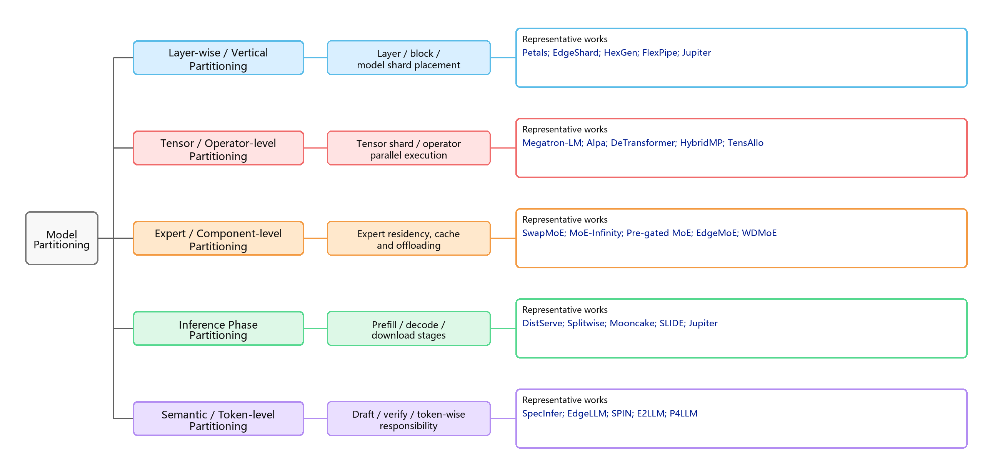
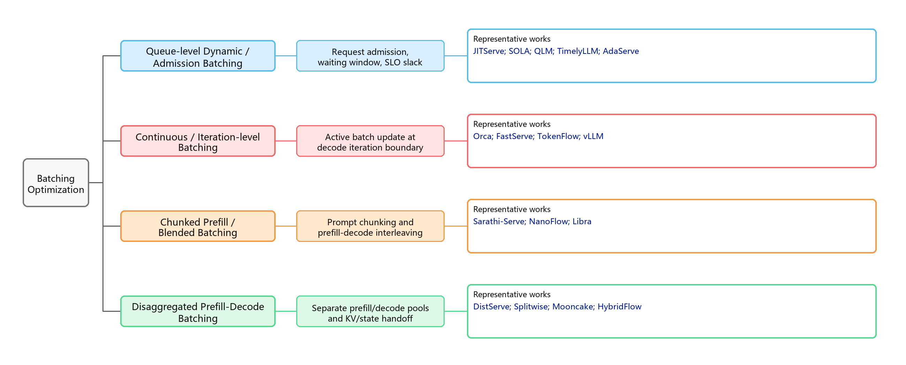

# 20260521 面向 CEC 场景的 LLM 推理优化：算法研究与应用综述

# 一、引言

## 11 研究背景与应用动机

大语言模型推理正在从单一部署形态走向云、边、端协同部署。现有 LLM inference 优化主要集中在两类场景：一类是 **ondevice inference**，通过模型压缩、量化、小模型设计和端侧 NPU/GPU 加速，使模型尽可能在终端本地运行；另一类是 **cloud / datacenter LLM serving**，通过高性能 kernel、continuous batching、KV Cache 管理、模型并行和多实例调度，在云侧 GPU 集群中提升吞吐、降低时延和摊薄成本。

这两类方向各有局限。端侧推理受限于算力、内存、功耗和散热，难以承载复杂大模型和高并发请求；云侧推理资源充足，但跨网络访问会带来端到端时延、带宽开销、隐私风险和服务路径依赖。同时，接入边缘、区域边缘和近用户算力节点中存在大量分散、异构且动态变化的可用资源，尚未被充分纳入大模型推理服务体系。

因此，CEC（CloudEdgeClient Collaborative Computing，云边端协同计算）为大模型推理提供了新的系统形态：通过整合端侧、边缘和中心云的分散式算力，使推理请求能够根据模型规模、请求复杂度、网络状态、节点负载、隐私要求和 QoS 目标，在端边云之间动态选择服务路径、模型形态和执行方式。CEC LLM inference 的核心问题不只是“如何让模型跑得更快”，而是“如何在异构、分布式、动态变化的端边云环境中，以可控成本满足业务 QoS以及数据隐私性”。

---

## 12 CEC 场景下边缘 AI 推理的关键挑战

1. **边缘节点资源异构且碎片化。** 端侧设备、接入边缘、区域边缘和中心云在 CPU、GPU、NPU、内存、显存、功耗和加速库支持上存在显著差异，模型部署不能简单沿用中心云中的均质集群假设。
2. **大模型推理具有显著的状态和内存压力。** LLM 推理存在显存占用高、KV Cache 动态增长、上下文长度和输出长度不确定、跨节点状态传输成本高等问题。
3. **请求到达和业务 SLA 高度动态。** 用户并发数、输入输出长度、请求复杂度和 SLA 时延要求持续变化，静态 batching 和固定调度策略难以稳定满足业务目标。
4. **用户移动导致服务入口和最优服务节点变化。** 最近接入节点不一定是端到端时延最低或负载最合适的推理实例，用户移动还可能带来 KV Cache、prefix cache 和 session state 的迁移或远程访问问题。
5. **多实例、多入口、多链路条件下服务决策复杂。** 请求调度需要同时考虑节点负载、网络状态、模型能力、数据依赖、状态位置、隐私约束和转发代价。
6. **端边云协同执行带来新的通信与一致性开销。** 模型切分、任务 offloading、prefill/decode 分离、KV 迁移和跨节点执行都会引入 activation、hidden state、KV Cache 或 session state 的传输成本，需要在计算收益和通信代价之间权衡。

---

## 13 国内外研究现状概述

现有研究主要分布在 ondevice inference、cloud/datacenter LLM serving、边缘计算任务卸载、移动边缘网络路由和端边云协同推理等方向。Ondevice 方向强调模型压缩、小模型设计和本地硬件加速；cloud/datacenter 方向强调高吞吐 serving、KV Cache 管理、batching/scheduling、模型并行和多实例负载均衡；边缘计算方向则长期关注任务卸载、资源分配、移动性管理和网络感知调度。

CEC LLM inference 位于这些方向的交叉处。它既需要处理 LLM serving 中的 prefill/decode、KV Cache、batching、speculative decoding 和分布式执行问题，也需要处理 CEC 中的异构资源、动态网络、用户移动、任务 offloading、状态迁移和 QoS 保障问题。

相关工作可以归纳为五条主线：

1. **模型动态切分与自适应部署**：关注模型如何在端、边、云之间部署、切分和动态调整。
2. **自适应 batching 与 prefill/decode 调度**：关注边缘低并发、强时延约束和动态网络条件下的请求、token 和执行阶段组织。
3. **分层 KV / 状态管理与通信优化**：关注 KV Cache、prefix cache、session state 和中间状态的缓存、复用、压缩、迁移与传输。
4. **任务 offloading 与端边云协同执行**：关注 requestlevel offloading 和 computationlevel offloading，以及端边云之间如何协同完成一次推理。
5. **策略路由、分层模型服务与移动性感知状态连续性**：关注请求如何选择模型、节点、服务路径和状态副本，并在用户移动和链路变化时保持服务连续性。

---

## 14 本文研究范围与主要贡献

本文聚焦 **CEC 场景下的大语言模型推理优化问题**。研究范围限定在推理阶段，不讨论大模型训练、预训练或微调过程；重点关注端侧、接入边缘、区域边缘和中心云之间的大模型推理协同，包括模型动态切分、自适应 batching、prefill/decode 调度、分层 KV/状态管理、任务 offloading、策略路由、移动性感知请求调度和服务连续性保障。

对于底层 kernel 优化、硬件实现和模型结构设计，本文仅在其影响 CEC 推理系统设计时进行讨论。例如，低比特 kernel 会影响模型能否部署在端侧或边缘设备上；KV Cache layout 会影响状态迁移和缓存复用；partitionfriendly model design 会影响模型是否适合跨端边云切分执行。本文的重点不是单独评估某个 kernel 或模型结构，而是从 CEC 系统角度分析这些技术如何影响大模型推理的部署、调度、状态管理和服务策略。

本文的主要贡献包括以下几点：

1. **梳理 LLM 推理的基本机制。**

本文首先介绍 LLM inference 的核心执行过程，包括 prefill/decode、KV Cache、batching/scheduling、decoding runtime 和主要服务指标，为后续分析 CEC 场景下的大模型推理优化奠定基础。

1. **总结 LLM inference 的问题空间。**

本文从模型计算复杂度、KV Cache 与内存状态、请求动态性与调度、decode 串行性、多实例/多 GPU/多服务路径协同等角度，归纳 LLM 推理优化中的主要问题方向，并解释这些问题如何从 LLM 的模型结构和在线生成机制中产生。

1. **构建面向优化对象的 Layer–Scope 分类框架。**

在已有 problemoriented taxonomy 的基础上，本文进一步从优化对象和执行范围出发，将 LLM inference 优化划分为 ModelLevel、KernelLevel、RuntimeLevel、Serving Policy  RoutingLevel 四个层级，并以 Local / Distributed 作为 Scope 维度，用于分析每类方法的 primary optimization object、execution scope 和 secondary effects。

1. **分析 CEC 环境下 LLM inference 优化重心的转移。**

本文指出，相较云侧集中式 LLM serving，CEC 场景需要额外考虑端边云资源异构、动态网络、边缘低并发、用户移动、状态迁移、隐私边界和 QoS 约束。因此，ModelLevel、KernelLevel、RuntimeLevel 和 Serving Policy  RoutingLevel 的优化重心都会发生变化。

1. **提出 CEC LLM inference 的五条综述主线。**

本文将 CEC 场景下的相关工作组织为五类：模型动态切分与自适应部署、自适应 batching 与 prefill/decode 调度、分层 KV/状态管理与通信优化、任务 offloading 与端边云协同执行、策略路由与分层模型服务及移动性感知状态连续性。每条主线分别总结核心问题、典型方法、决策变量和优化目标。

1. **总结评估维度与未来挑战。**

本文从时延、吞吐、QoS、资源利用率、通信开销、状态迁移成本、隐私约束、服务连续性和系统可部署性等角度总结 CEC LLM inference 的评估维度，并讨论未来在跨层协同优化、状态感知 routing、移动性预测、异构 runtime、分层模型服务和真实系统落地方面的关键挑战。

---

# **二、LLM 推理基础、问题空间与优化分类**

## **21 LLM 推理的基本执行机制**

LLM 推理可以理解为一个在线生成服务过程：系统接收用户输入上下文，并以自回归方式逐 token 生成输出。与传统 DNN 推理相比，LLM 推理的特殊性在于输入长度和输出长度动态变化，decode 阶段存在强状态依赖，KV Cache 会随上下文长度和生成长度持续增长，系统需要在吞吐、时延、显存占用和服务质量之间持续权衡。

### **211 Prefill 与 Decode**

LLM 推理通常分为两个阶段：**Prefill** 和 **Decode**。

**Prefill 阶段**负责处理完整输入上下文，包括用户 prompt、历史对话、系统提示词和检索增强内容等。模型会对整段上下文并行计算 attention 和 FFN，并为每一层生成后续 decode 需要复用的初始 KV Cache。该阶段矩阵规模较大、并行度较高，通常更偏 computebound，主要影响 TTFT，即 Time To First Token。

**Decode 阶段**负责逐 token 生成输出。每一步 decode 输入上一步生成的新 token，同时读取历史 KV Cache，计算当前 token 的 attention 和 FFN，并将当前 token 对应的新 KV 写回缓存。该阶段每步计算粒度较小、状态依赖强、访存频繁，通常更偏 memorybound 或 latencybound，主要影响 TPOT、ITL 和持续生成吞吐。

Prefill 和 Decode 的资源特征差异是 LLM serving 优化的核心背景之一。Prefill 更像大矩阵并行计算，Decode 更像高频、小粒度、状态密集的在线执行。因此，很多 serving 系统会围绕 prefill/decode 的差异设计 batching、调度、KV 管理和分布式执行策略。

---

### **212 KV Cache**

KV Cache 是 LLM decode 阶段最核心的运行时状态。自回归生成中，第 t 个 token 的 attention 需要访问前面所有 token 的 key/value。如果每一步都重新计算历史 token 的 key/value，会产生大量重复计算。KV Cache 的作用是在 prefill 阶段保存历史 token 的 key/value，在 decode 阶段复用这些历史 KV，只为新 token 计算新增 KV。

KV Cache 降低了 decode 阶段的重复计算，但也引入了显著的内存状态问题。KV 占用会随 batch size、上下文长度、输出长度、模型层数和 KV head 数增长。在长上下文、多轮对话和高并发场景中，KV Cache 往往成为显存容量和显存带宽的重要瓶颈。近期 inference systems survey 也将 memory management 单独作为 LLM inference systems 的关键主题，覆盖 paged memory、eviction、offloading、quantization 和 cache persistence 等方向。 

典型 KV 相关优化包括：

| **方向**                         | **作用**                       |
| ------------------------------ | ---------------------------- |
| PagedAttention / memory paging | 降低 KV 分配碎片，提高显存利用率           |
| Prefix cache / RadixAttention  | 复用共享前缀，减少重复 prefill          |
| KV compression / quantization  | 降低 KV 存储和传输成本                |
| KV eviction                    | 在显存不足时淘汰低价值 KV               |
| KV offloading                  | 将部分 KV 放到 CPU、本地存储、远端内存或其他节点 |
| Distributed KV cache           | 在多 worker / 多节点场景下管理 KV 状态分布 |

---

### **213 Batching 与 Scheduling**

Batching 是 LLM serving 提高硬件利用率和吞吐量的核心机制。单个请求，尤其是 decode 阶段，每一步计算粒度较小。如果只服务单请求，加速器容易出现算力空闲。Batching 通过把多个请求合并执行，扩大矩阵运算规模，提高 GPU/NPU occupancy，并摊薄 kernel launch、调度和访存开销。

但 LLM batching 与传统 DNN batching 不同。LLM 请求的输入长度、到达时间和输出长度差异很大；decode 阶段请求会逐步完成，batch slot 会动态空出；长 prompt prefill 可能阻塞短请求 decode。因此，现代 LLM serving 系统通常需要 dynamic batching、continuous batching、iterationlevel scheduling 和 chunked prefill 等机制。近期 inferencesystem survey 也将 batching 和 scheduling 与 kernel design、memory management 一起作为 LLM inference systems 的核心组成部分。 

典型调度机制包括：

| **机制**                         | **作用**                                      |
| ------------------------------ | ------------------------------------------- |
| Dynamic batching               | 根据请求到达情况动态组成 batch                          |
| Continuous batching            | 在每个 decode iteration 动态加入新请求、移除完成请求         |
| Iterationlevel scheduling      | 以 token iteration 为粒度调度请求                   |
| Chunked prefill                | 将长 prompt prefill 拆成多个 chunk，降低对 decode 的阻塞 |
| Priority / fairness scheduling | 根据 SLA、优先级和公平性调整请求顺序                        |
| Admission control              | 在资源紧张时控制进入系统的请求量                            |

Batching 的核心目标不是简单最大化 batch size，而是在 throughput、TTFT、TPOT、ITL、显存占用和 SLA 达标率之间做动态平衡。

---

### **214 主要性能指标**

LLM inference 通常同时关注以下指标：

| **指标**              | **含义**                                   |
| ------------------- | ---------------------------------------- |
| TTFT                | Time To First Token，首 token 延迟           |
| TPOT                | Time Per Output Token，平均每个输出 token 的生成时间 |
| ITL                 | Intertoken Latency，相邻 token 输出间隔         |
| E2E latency         | 从请求到完整响应结束的端到端时延                         |
| Throughput          | 单位时间处理的 request 数或 token 数               |
| Goodput             | 满足 SLA 的有效吞吐                             |
| GPU/NPU utilization | 加速器计算单元利用率                               |
| Memory footprint    | 权重、activation、KV Cache 等占用               |
| Cost per token      | 单位 token 的计算、显存和服务成本                     |

---

## **22 LLM 推理的问题空间：从执行机制到系统瓶颈**

LLM inference 的主要问题不是来自单一环节，而是由模型规模、自回归生成、KV 状态增长、请求动态性和服务化部署共同导致的。已有 overview survey 通常采用 **problemoriented taxonomy**，即按照“主要解决什么问题”来组织文献。

例如，2024 年的 efficient inference survey 将 LLM inference 低效的主要来源概括为模型规模大、attention 二次复杂度高和自回归 decoding，并将优化工作组织为 datalevel、modellevel 和 systemlevel 三类。  面向 serving 的 **Taming the Titans** 则采用 servingoriented taxonomy，将方法组织为 instancelevel approaches、clusterlevel strategies、emerging scenarios 和 miscellaneous areas；其中 instance level 包括 model placement、request scheduling、decoding length prediction、storage management 和 disaggregation，cluster level 则关注 GPU cluster deployment、multiinstance load balancing 和 cloud service solutions。  另一篇 **A Survey of LLM Inference Systems** 则按 inferencesystem pipeline 组织，先讨论 request processing operators and algorithms，再讨论 model optimization and execution，其中包括 kernel design、batching、scheduling，最后讨论 memory management，包括 paged memory、eviction、offloading、quantization 和 cache persistence；随后再讨论 singlereplica、multireplica、disaggregated 和 serverless inference systems。 

综合这些 survey 的 problemoriented view，可以将 LLM inference 的问题空间概括为以下几类。

---

### **221 计算复杂度与模型规模问题**

LLM 参数规模大，单次 forward 的 FLOPs 高，attention 和 FFN 都会带来大量矩阵计算。长上下文进一步放大 attention 的计算和存储开销。相关优化通常关注如何从模型结构、参数表示或算子执行上降低计算复杂度。

典型问题包括：

- 权重规模大，加载和常驻显存成本高。
- FFN 和 attention 计算量大，推理成本高。
- 长上下文 attention 带来更高计算和 KV 存储压力。
- MoE 等模型虽然降低单 token 激活参数量，但引入 expert routing 和 alltoall 通信问题。

对应优化方向包括模型压缩、量化、剪枝、蒸馏、GQA/MQA/MLA、efficient attention、MoE 优化、低比特执行和高效 attention kernel。

---

### **222 KV Cache 与内存状态问题**

KV Cache 将 decode 从重复计算历史上下文变为增量计算当前 token，但代价是引入持续增长的运行时状态。上下文越长、batch 越大、并发越高，KV Cache 越容易成为显存容量和带宽瓶颈。

典型问题包括：

- KV Cache 显存占用随上下文长度和并发增长。
- KV 分配和释放动态变化，容易产生碎片。
- 多轮对话和共享 prompt 场景中存在重复 prefill。
- 跨 worker / 跨节点场景中 KV 传输、迁移和复用成本高。
- KV offloading 会引入 CPUGPU、hostdevice 或网络传输开销。

对应优化方向包括 PagedAttention、prefix cache、KV compression、KV quantization、KV eviction、KV offloading、distributed KV cache 和 remote KV serving。

---

### **223 请求动态性与调度问题**

LLM 请求具有高度动态性：prompt 长度不同、输出长度未知、请求到达时间随机、服务质量目标不同。Prefill 和 decode 的资源特征也不同，长 prefill 可能阻塞短 decode，请求完成时间差异又会导致 batch 内部动态变化。

典型问题包括：

- 请求长度和输出长度差异导致 headofline blocking。
- 等待凑 batch 可以提高吞吐，但会增加 TTFT。
- 过大的 batch 会推高单请求时延和显存占用。
- Prefill 和 decode 混合执行时存在资源干扰。
- 不同租户或请求优先级带来 fairness 和 SLA 问题。

对应优化方向包括 dynamic batching、continuous batching、iterationlevel scheduling、chunked prefill、deadlineaware scheduling、priority scheduling 和 admission control。

---

### **224 Decode 串行性与生成加速问题**

LLM decode 是自回归过程，每一步依赖前一步输出，天然存在串行依赖。即使单步 forward 被加速，逐 token 生成仍可能造成较高 TPOT 和 ITL。

典型问题包括：

- 每次只生成一个 token，串行步数多。
- 单步 decode 计算粒度小，硬件利用率不足。
- Sampling、beam search 或复杂 decoding policy 会增加控制和计算开销。
- Draft/verify 等加速方法需要在 acceptance rate、额外计算和系统复杂度之间权衡。

对应优化方向包括 speculative decoding、assisted decoding、parallel decoding、tree decoding、beam search optimization、multitoken prediction 和 adaptive drafter selection。

---

### **225 多实例、多 GPU 与服务级编排问题**

当模型规模、并发量或服务可用性需求超过单设备能力时，系统需要跨多个 GPU、worker、replica 或节点协同。此时问题从单个 engine 内部执行扩展为分布式执行和服务级调度。

典型问题包括：

- 模型无法放入单设备，需要 tensor/pipeline/expert/context parallel。
- Prefill 和 decode 特性不同，可能需要拆分到不同 worker。
- KV、activation 和中间状态需要跨设备或跨节点传输。
- 多 replica 负载不均会影响吞吐和 SLA。
- 多模型、多服务路径下，需要在质量、时延和成本之间做服务级选择。

对应优化方向包括 distributed parallelism、prefill/decode disaggregation、distributed KV cache、KV transfer、replica routing、cluster load balancing、cascade serving 和 speculative serving orchestration。

---

## 23 LLM Inference Optimization Taxonomy：以优化对象为主轴的分类

已有 overview survey 通常从不同角度组织 LLM inference optimization。Efficient inference survey 倾向于将方法划分为 datalevel、modellevel 和 systemlevel optimization；inference systems survey 进一步将 systemlevel 方法拆解为 kernel design、batching/scheduling、memory management 和 single/multireplica systems；servingoriented survey 则强调 instancelevel approaches、clusterlevel strategies 和 emerging scenarios。综合这些视角，本报告采用一个更适合工程分析的 **Layer–Scope Taxonomy**：以优化对象所在的系统抽象层作为主轴，以 Local / Distributed 作为执行范围副轴。

其中，Layer 轴包括四类：ModelLevel、KernelLevel、RuntimeLevel 和 Serving Policy  RoutingLevel。Scope 轴包括两类：Local 和 Distributed。Local 表示优化限制在单个 serving instance 或本地控制域内，可以包含 CPUGPU/NPU/本地存储等本地异构资源协同；Distributed 表示优化需要跨多个 GPU、device、worker、replica、service 或 node 协同，并涉及 computation、request、KV state、activation 或 routing decision 的跨实体分布。

该 taxonomy 不要求所有方法完全互斥。真实 LLM serving 系统通常是 crosslayer codesign。对于一项具体工作，本报告主要关注三个问题：它解决什么 inference problem，主要优化对象在哪一层，以及该优化发生在 Local 还是 Distributed scope。

### 231 ModelLevel Optimization

ModelLevel Optimization 的核心是改变模型本身，从源头降低 inference complexity。它优化的是模型参数、参数表示、结构设计或算法语义。只要优化后的模型即使脱离具体 serving engine 仍然成立，就可以认为主要属于 ModelLevel。

ModelLevel 主要优化对象包括：

- 参数量和权重表示；
- FLOPs 和激活计算量；
- attention complexity；
- KV size；
- 模型结构和条件计算路径。

在 **Local scope** 下，典型方向包括：

- **Compression**：weight quantization、pruning、distillation、lowrank、weight sharing。
- **KVefficient architecture**：GQA、MQA、MLA 等减少 KV size 或 attention 状态的结构。
- **Efficient architecture**：linear attention、sparse attention、state space models、efficient Transformer variants。
- **Conditional computation**：early exit、token pruning、dynamic sparsity、轻量 MoE。

在 **Distributed scope** 下，ModelLevel 主要体现为 distributedaware model architecture 或 distributedaware parameterization，例如：

- 面向 expert parallelism 设计的 MoE architecture；
- 更适合 tensor/context parallel 的 attention 或 KV 结构；
- 更容易按 layer、expert、context 或 activation 维度切分的模型结构；
- 支持多层级模型服务的 model family，例如 small / medium / large model family。

需要注意，ModelLevel 不包括一般的 execution graph optimization。CUDA Graph、operator fusion、TensorRT execution graph 优化等主要改变的是执行路径或部署图，而不是模型语义本身，应归入 RuntimeLevel 或 KernelLevel。

---

### 232 KernelLevel Optimization

KernelLevel Optimization 的核心是在不改变模型数学语义的前提下，优化 tensor operator 或 communication primitive 在硬件上的执行效率。它关注的是 attention、GEMM、normalization、sampling、collective communication 等底层执行单元如何更快、更省显存带宽、更高效地利用硬件。

KernelLevel 主要优化对象包括：

- GPU/NPU utilization；
- HBM traffic；
- SRAM/cache reuse；
- Tensor Core / NPU special unit utilization；
- operator throughput；
- communication primitive efficiency。

在 **Local scope** 下，典型方向包括：

- **Attention kernel optimization**：FlashAttention、FlashDecoding、paged attention kernel path。
- **Kernel fusion**：fused MLP、fused RMSNorm、fused softmax、fused attention。
- **Lowbit kernels**：INT8 GEMM、INT4/W4A16 kernels、FP8 kernels、quantized attention kernels。
- **Hardwareaware execution**：tiling、memory layout、warp/thread scheduling、operatorspecific optimization。
- **Sampling / postprocessing kernels**：fused sampling、GPUside logits processing、stop condition check。

在 **Distributed scope** 下，KernelLevel 主要对应通信 primitive 本身的优化，包括：

- allreduce、allgather、reducescatter、alltoall；
- RDMA / NVLink transfer path；
- fused communication primitives；
- collective algorithm selection；
- MoE expert dispatch / combine primitive。

需要区分的是，如果优化对象是 collective / P2P primitive 的实现路径，归为 KernelLevel × Distributed；如果优化对象是通信与计算在 runtime pipeline 中的编排、重叠和调度，则归为 RuntimeLevel × Distributed。

---

### 233 RuntimeLevel Optimization

RuntimeLevel Optimization 是现代 LLM serving 的核心层。它发生在请求进入 inference engine 之后，围绕在线 token execution、KV state、batch composition、decode loop 和 execution pipeline 做动态管理。RuntimeLevel 不改变模型本身，也不一定改变单个 kernel，而是决定请求到达后如何高效执行。

RuntimeLevel 可以进一步细分为四类：KV / Memory Runtime、Batching / Scheduling Runtime、Decoding Runtime 和 Execution Runtime。

#### A KV / Memory Runtime

KV / Memory Runtime 关注 KV lifecycle、memory state 和 cache reuse。它的核心问题是：KV Cache 如何存储、复用、压缩、淘汰、迁移或远程访问。

在 **Local scope** 下，典型方向包括：

- KV cache management；
- PagedAttention / memory paging；
- Prefix cache / RadixAttention；
- KV compression / quantization；
- KV eviction；
- KV offloading；
- cache persistence；
- runtime memory allocator。

在 **Distributed scope** 下，典型方向包括：

- distributed KV cache；
- KV transfer / migration；
- remote KV serving；
- multireplica KV reuse；
- distributed prefix cache；
- KVaware placement；
- crossworker state synchronization。

这一类优化的核心目标是降低 KV 显存占用、减少重复 prefill、提升 cache reuse，并在分布式场景下控制 KV 传输和状态迁移成本。

#### B Batching / Scheduling Runtime

Batching / Scheduling Runtime 关注请求和 token 在 inference engine 内如何组织执行。它回答的是：哪些请求何时执行，哪些 token 可以组成 batch，prefill 和 decode 如何交错，如何在 throughput、TTFT、TPOT、ITL、公平性和 SLA 之间做权衡。

在 **Local scope** 下，典型方向包括：

- dynamic batching；
- continuous batching；
- iterationlevel scheduling；
- chunked prefill；
- prefill/decode interleaving；
- enginelocal admission control；
- priority / fair scheduling；
- deadlineaware scheduling。

在 **Distributed scope** 下，典型方向包括：

- crossworker scheduling；
- distributed continuous batching；
- prefill worker / decode worker scheduling；
- heterogeneous GPU scheduling；
- multireplica queue coordination；
- distributed admission control；
- SLOaware worker scheduling。

这一类优化的核心目标是在动态请求负载下提高硬件利用率，同时控制排队时延和服务质量。

#### C Decoding Runtime

Decoding Runtime 关注在线 token generation procedure。它回答的是：输出 token 如何生成、验证、选择和接受。它不主要决定请求如何组 batch，也不主要决定计算如何 launch，而是改变 decode loop 的生成逻辑。

在 **Local scope** 下，典型方向包括：

- speculative decoding；
- assisted decoding；
- parallel decoding；
- tree decoding；
- beam search optimization；
- ngram speculation；
- prompt lookup decoding；
- servingtime multitoken prediction / verification。

在 **Distributed scope** 下，典型方向包括：

- distributed verification；
- draft / target execution split；
- multidraft execution；
- batched verification across workers；
- draft model 与 target model 分布式协同；
- speculative decoding 与 prefill/decode disaggregation 的结合。

Speculative decoding 这类方法有时也被称为 decoding algorithm。本报告将其归入 RuntimeLevel，是因为其主要改变 serving 时的在线 token generation procedure，而不是模型参数或架构本身。但如果某种 multitoken prediction 方法引入额外训练 heads 或改变模型结构，则应标注 ModelLevel primary 或 secondary。

#### D Execution Runtime

Execution Runtime 关注 scheduled work 如何 launch、overlap、replay 和执行。当前面的 runtime 已经决定哪些请求要运行、batch 如何组成、decode 如何进行之后，Execution Runtime 负责将计算、数据搬运和通信高效提交到硬件，并组织成流水线执行。

在 **Local scope** 下，典型方向包括：

- CUDA Graph / HIP Graph / graph replay；
- async execution；
- stream scheduling；
- CPUGPU overlap；
- hostdevice communication hiding；
- compute / memorycopy overlap；
- runtime metadata / buffer reuse；
- GPUside sampling execution path。

在 **Distributed scope** 下，典型方向包括：

- tensor parallel runtime；
- pipeline parallel runtime；
- expert parallel runtime；
- context / sequence parallel runtime；
- prefill/decode disaggregation；
- distributed execution pipeline；
- communicationcomputation overlap scheduling；
- activation / KV transfer orchestration。

Execution Runtime 与 KernelLevel 的边界在于：KernelLevel 优化单个 operator 或 communication primitive 的实现；Execution Runtime 优化一组 operator、copy 和 communication 的 launch、同步、overlap 和流水化组织方式。

---

### 234 Serving Policy  RoutingLevel Optimization

Serving Policy  RoutingLevel Optimization 关注更粗粒度的服务级控制决策。它不直接优化单个 engine 内部 token 如何执行，而是决定请求进入哪个模型、adapter、replica、worker pool 或 service path，以及是否进行 fallback、cascade、escalation 或多服务编排。

Serving Policy  RoutingLevel 主要优化对象包括：

- request assignment；
- model / adapter selection；
- replica / worker selection；
- service path selection；
- fallback / escalation；
- cascade policy；
- SLO / cost / latency policy；
- multiservice orchestration。

在 **Local scope** 下，典型方向包括：

- local model selection；
- adapter / LoRA routing；
- local cascade serving；
- normal decoding vs speculative decoding path selection；
- drafter selection；
- local/cloud fallback；
- budgetaware local inference；
- latencyaware local policy。

在 **Distributed scope** 下，典型方向包括：

- replica routing；
- workerpool routing；
- cluster load balancing；
- SLOaware routing；
- costaware routing；
- regionaware routing；
- KVaware routing；
- speculative serving orchestration；
- drafttarget worker orchestration；
- multiservice graph orchestration。

RuntimeLevel 和 Serving Policy  RoutingLevel 在真实系统中强耦合，但 primary decision object 不同。RuntimeLevel 解决“请求进入某个 engine 后如何执行”；Serving Policy  RoutingLevel 解决“请求应该交给哪个模型、worker、replica 或服务路径”。后者经常依赖 runtime feedback，例如 queue length、KV cache pressure、batch state 和 SLO slack。

---

## 26 工业级 LLM Inference Framework 代表性机制映射

为了避免分类停留在抽象概念层面，下表选取若干主流工业级 LLM inference framework 中最具有代表性的机制，并将其映射到前述 Layer–Scope Taxonomy。该表不追求覆盖各框架的全部功能，而是展示每个框架最核心、最能体现其系统设计特点的若干机制。

| **Framework**            | **代表性方法 / 机制**               | **解决的具体问题**                                      | **优化方向分类层 Scope**                                             | **具体方法说明**                                    |
| ------------------------ | ---------------------------- | ------------------------------------------------ | ------------------------------------------------------------- | --------------------------------------------- |
| **vLLM**                 | PagedAttention               | KV Cache 动态分配和显存碎片问题                             | Runtime / KVMemory × Local                                    | 通过分页式 KV 管理降低显存碎片，提高 KV Cache 利用率             |
|                          | Continuous batching          | Decode 阶段请求动态进出，静态 batch 利用率低                    | Runtime / BatchingScheduling × Local                          | 在 decode iteration 动态加入和移除请求，提高高并发吞吐          |
|                          | Chunked prefill              | 长 prompt prefill 阻塞 decode，影响 TTFT / ITL         | Runtime / BatchingScheduling × Local                          | 将长 prefill 拆分为 chunk，与 decode 交错执行            |
|                          | Prefix caching               | 多请求共享前缀导致重复 prefill                              | Runtime / KVMemory × Local/Distributed                        | 复用共享 prompt 或 prefix，减少重复 prefill 计算          |
| **TensorRTLLM**          | Inflight batching            | 高并发请求长度不同，传统 batching 效率低                        | Runtime / BatchingScheduling × Local                          | 对不同阶段和长度的请求进行动态批处理                            |
|                          | Paged KV Cache               | KV Cache 分配、复用和显存管理问题                            | Runtime / KVMemory × Local                                    | 通过 paged KV 管理改善 KV Cache 利用率                 |
|                          | FP8 / INT8 / INT4 execution  | 权重、activation 和算子执行成本高                           | Model Kernel × Local/Distributed                              | 通过低比特模型表示和低比特 kernel 降低显存和计算成本                |
|                          | Overlap scheduler            | compute、copy、communication、prefill/decode 没有充分重叠 | Runtime / Execution × Local/Distributed                       | 将计算、通信和数据搬运流水线化，减少等待                          |
| **SGLang**               | RadixAttention               | 多轮、多分支请求存在大量共享前缀                                 | Runtime / KVMemory × Local                                    | 用 radix tree 组织 prefix cache，提高共享前缀复用         |
|                          | Zerooverhead CPU scheduler   | 高并发场景下 CPU 调度开销影响吞吐                              | Runtime / BatchingScheduling × Local                          | 降低 CPU 侧调度和 metadata 管理开销                     |
|                          | Prefilldecode disaggregation | Prefill 和 decode 资源特征不同，混部互相干扰                   | Runtime / Execution × Distributed                             | 将 prefill 与 decode 分离到不同资源池，减少资源干扰            |
|                          | MultiLoRA batching           | 多 adapter 请求混合服务时 batch composition 复杂、吞吐下降      | Serving Policy Routing Runtime/Scheduling × Local/Distributed | 将不同 LoRA / adapter 请求合并调度，提高多 LoRA serving 效率 |
| **Hugging Face TGI**     | Continuous batching          | incoming requests 动态变化，传统 batching 吞吐不足          | Runtime / BatchingScheduling × Local                          | 动态合并请求，提高在线 serving 吞吐                        |
|                          | Flash Attention              | attention HBM traffic 高，operator throughput 受限   | Kernel × Local                                                | 通过高效 attention kernel 降低显存访问并提升算子吞吐           |
|                          | Paged Attention              | KV Cache / attention memory 管理效率不足               | Runtime / KVMemory × Local                                    | 通过 paged attention 改善 attention/KV memory 管理  |
|                          | Tensor parallelism           | 单 GPU 容量或吞吐不足，需要跨 GPU 执行                         | Runtime / Execution × Distributed                             | 将模型执行切分到多个 GPU，提高模型容量和吞吐                      |
| **LMDeploy / TurboMind** | Persistent batching          | 高并发请求动态调度，提高吞吐                                   | Runtime / BatchingScheduling × Local                          | 通过持续批处理机制维持 batch 执行效率                        |
|                          | Blocked KV Cache             | KV Cache 显存管理和访问效率问题                             | Runtime / KVMemory × Local                                    | 通过 blockbased KV 管理改善显存利用率                    |
|                          | Dynamic split fuse           | 长 prompt 和 decode 混合执行效率低                        | Runtime / BatchingScheduling × Local                          | 动态拆分和融合 prefill / decode 任务，提高混合负载效率          |
|                          | Tensor parallelism           | 大模型需要跨 GPU 执行                                    | Runtime / Execution × Distributed                             | 支持模型在多 GPU 上并行执行                              |

---

## **26 小结**

本章首先介绍了 LLM inference 的基本执行机制，包括 prefill/decode、KV Cache、batching/scheduling 和主要性能指标。随后，从执行机制出发，总结了 LLM inference 的主要问题空间，包括计算复杂度与模型规模、KV Cache 与内存状态、请求动态性与调度、decode 串行性与生成加速，以及多实例、多 GPU 与服务级编排问题。

在已有 survey 的 problemoriented taxonomy 基础上，本章进一步采用 Layer–Scope taxonomy 组织 LLM inference optimization：以 Model、Kernel、Runtime、Serving Policy  Routing 作为优化对象主轴，以 Local / Distributed 作为执行范围副轴，并在 RuntimeLevel 内部细分为 KV / Memory Runtime、Batching / Scheduling Runtime、Decoding Runtime 和 Execution Runtime。该分类方式保留了既有 survey 对问题空间的概括能力，同时更适合分析具体优化机制的实现位置、主要优化对象和分布式边界。

最后，本章通过主流工业级 inference framework 的代表性机制映射，展示了真实系统通常不是单点优化，而是组合模型表示、kernel、KV/memory runtime、batching/scheduling、execution runtime、distributed execution 和 serving policy 等多层机制。该分类框架将作为后续分析 CEC/MEC 场景下模型部署、请求调度、KV 状态迁移、服务路径选择和端边云资源协同优化的基础。

# 三、CEC 场景下的大模型推理

## 31 CEC LLM 推理的系统形态

CEC 场景下的大模型推理面向端侧设备、接入边缘、区域边缘和中心云组成的多层协同系统。请求可以从终端、基站、边缘网关或区域入口进入；模型、KV Cache、prefix cache、session state 和中间状态可以部署在端、边、云的不同位置；一次推理既可能在某个本地边缘实例内完成，也可能通过端边、边云或端边云协同完成。

与云侧集中式 LLM serving 相比，CEC 的关键变化在于：推理系统从“资源相对集中、网络稳定、控制面统一的 datacenter serving”，转变为“地理分布、资源异构、网络受限、用户移动、状态分散条件下的协同推理服务”。

因此，CEC LLM inference 不仅需要优化单个模型或单个 serving engine 的执行效率，还需要在更复杂的系统边界内联合考虑：

- 请求应该在哪一层服务：端侧、接入边缘、区域边缘还是中心云。
- 模型应该如何部署：完整部署、分级部署、动态切分部署还是按需加载。
- 推理任务是否需要 offload：整个请求 offload，还是只 offload 部分计算阶段、模型层或中间状态。
- KV Cache 和 session state 应该放在哪里：本地保留、边缘缓存、跨节点迁移、远程访问还是云端持久化。
- Batching 和 scheduling 如何设计：边缘低并发条件下如何兼顾 TTFT、TPOT、吞吐和 QoS。
- 服务路径如何动态调整：根据网络、负载、用户位置、隐私约束和 QoS 目标做自适应选择。

从前文的 Layer–Scope taxonomy 看，CEC 并不是引入一个新的优化层，而是改变了各个 layer 的优化重心，并显著强化了 **Distributed Scope** 和 **Serving Policy  RoutingLevel** 在系统中的作用。

---

## 32 CEC 相较云侧集中式 LLM Serving 新增的问题空间

### 321 端侧与边缘资源约束

端侧和边缘节点的算力、内存、显存、功耗和散热预算有限，难以像云侧 GPU 集群一样承载完整大模型或大规模并发请求。模型部署需要考虑是否能放入目标节点、是否能在功耗预算内稳定运行、是否需要量化压缩、是否需要拆分执行，以及是否需要通过端侧小模型、边缘中模型和云端大模型形成分层模型体系。

因此，CEC 场景中的模型部署问题不再只是“模型能否跑得更快”，而是变成：

- 模型是否能部署在端侧或边缘节点。
- 简单请求是否可以由本地小模型处理。
- 复杂请求是否需要升级到边缘或云端模型。
- 模型是否需要动态切分到端、边、云不同节点。
- 模型能力、节点资源、链路状态和业务 QoS 如何匹配。

---

### 322 端边云异构性

CEC 系统中可能同时存在 CPU、移动 GPU、端侧 NPU、边缘 GPU、边缘 NPU 和云端 GPU。不同节点的算力、显存、内存层级、低比特支持、kernel 能力和 runtime 能力并不一致。

因此，云侧集中式 serving 中常见的“围绕统一 GPU 后端优化 kernel 和 runtime”的假设在 CEC 中不再成立。CEC 场景需要进一步考虑：

- 不同节点是否支持同一模型格式和精度格式。
- 不同后端是否支持相同 operator、attention kernel、lowbit GEMM 和 KV layout。
- 同一个模型是否需要针对端侧、边缘和云端生成不同部署版本。
- 是否会因为 unsupported operator、layout conversion 或 fallback 造成显著额外开销。
- 不同硬件之间的数据搬运和格式转换是否抵消协同执行收益。

---

### 323 网络约束与通信成本

CEC 中的无线链路、端边链路、边云链路和边缘节点之间链路具有不同的带宽、时延、抖动和稳定性。LLM inference 中 activation、hidden state、KV Cache、prefix cache、session state 和中间结果的数据量可能很大，因此通信成本会直接影响协同推理是否值得执行。

典型问题包括：

- 模型切分点需要考虑 activation 或 hidden state 的传输成本。
- KV Cache 迁移需要在网络传输成本和重复 prefill 成本之间权衡。
- Prefill 和 decode 分离可能受到 KV transfer 时延影响。
- Task offloading 不仅取决于计算能力，也取决于链路状态。
- 网络抖动会影响 TTFT、TPOT、ITL 和尾延迟。

---

### 324 边缘请求动态与低并发问题

边缘节点的请求到达通常具有地理局部性、突发性和不均衡性。单个边缘节点不一定拥有稳定的大规模请求池，因此 batching 条件弱于云侧集中式集群。同时，CEC 应用通常对实时性更敏感，等待凑 batch 可能显著影响 TTFT 和用户体验。

因此，CEC 中的 batching 和 scheduling 不能只追求吞吐最大化，而需要综合考虑：

- 边缘节点当前队列长度。
- 请求 deadline 和服务等级。
- 网络状态和传输时间。
- 用户位置和接入点变化。
- Prefill 和 decode 的资源干扰。
- 小 batch 下的硬件利用率和单位 token 成本。

这会使 CEC runtime 更偏向短窗口 microbatching、deadlineaware scheduling、prefill/decode 自适应调度，以及网络感知的请求执行策略。

---

### 325 用户移动与状态连续性

CEC 场景中，用户位置可能变化，接入点和最优服务节点也可能随之变化。对于短请求，重新路由可能只影响一次服务路径；但对于长对话、长上下文和多轮交互，KV Cache、prefix cache 和 session state 的连续性会成为核心问题。

用户移动会引出以下问题：

- 当用户从一个边缘区域移动到另一个边缘区域时，是否迁移 KV Cache。
- 如果不迁移状态，是否重新 prefill，成本是多少。
- 如果远程访问原边缘节点的 KV，链路时延是否可接受。
- 用户移动是否触发 serving instance handover。
- 状态迁移是否会影响隐私、带宽和 QoS。
- 如何根据用户位置预测提前做状态预取或副本放置。

因此，CEC 中的状态管理不再只是单个 engine 内的 KV cache management，而是进一步扩展为 mobilityaware state placement、KV migration、session migration 和 handoveraware routing。

---

### 326 隐私、数据本地性与 QoS 差异

CEC 应用中，部分 prompt、用户上下文、传感器数据或业务数据可能不适合上传到云端。隐私约束和数据本地性要求会限制模型选择、服务路径和 offloading 范围。

同时，CEC 面向的应用可能具有明显的 QoS 差异。例如，AR/VR、车联网、工业控制、智能终端助手和视频分析对 TTFT、ITL、尾延迟、可用性和稳定性的要求不同。因此，CEC LLM serving 需要将隐私、数据位置和 QoS 目标纳入服务策略。

典型问题包括：

- 哪些请求必须在端侧或边缘完成。
- 哪些中间状态不能上传到云端。
- 如何在隐私约束下选择模型和服务路径。
- 如何为不同业务设置不同的 latency、cost 和 quality tradeoff。
- 如何在节点过载、链路恶化或 SLA 即将违约时执行 fallback 或 escalation。

---

## 33 CEC 场景下 LLM Inference 优化重心的转移

前文提出的 Layer–Scope taxonomy 将 LLM inference 优化划分为四个主要层级：**ModelLevel、KernelLevel、RuntimeLevel、Serving Policy  RoutingLevel**。其中 Distributed 不再作为单独 layer，而是作为 Scope 轴，描述一个方法是否跨多个 GPU、device、worker、replica、service 或 node 协同执行。

在 CEC 场景下，这一分类仍然适用，但各层的优化重心会发生明显变化：

- **ModelLevel** 从“降低模型计算复杂度”进一步转向“面向端边云资源差异的可部署模型体系”。
- **KernelLevel** 从“优化单一 GPU 后端的算子性能”转向“适配异构端边云硬件后端”。
- **RuntimeLevel** 从“单个 serving engine 内的 token、KV、batch 和 execution pipeline 管理”转向“网络、状态、节点负载和 QoS 感知的在线执行管理”。
- **Serving Policy  RoutingLevel** 从“多模型、多 replica 或多 worker 的服务选择”转向“端边云服务路径、模型层级、状态位置、隐私约束和 QoS 目标的联合决策”。

---

### 331 CEC 场景下的 ModelLevel 优化重心

在 CEC 环境下，模型需要适配端侧、接入边缘、区域边缘和中心云等不同能力节点。不同节点在算力、内存、能耗、硬件后端和隐私边界上存在明显差异。因此，ModelLevel 优化不再只是让模型更小或更快，而是要形成可分级、可部署、可协同的模型体系。

主要方向包括：

- **Edgenative Model Design**：设计适合端侧或近边缘部署的小模型、专用模型或领域模型，使简单请求、低时延任务和隐私敏感任务能够在本地或边缘完成。
- **Deploymentaware Compression**：根据端侧和边缘硬件实际支持的量化、剪枝、低比特格式和算子能力进行压缩，避免模型压缩后无法在目标硬件上高效执行。
- **Multitier Model Family**：构建端侧小模型、边缘中等模型和云端大模型组成的模型族，使系统可以根据请求复杂度、网络状态、隐私要求和 QoS 目标动态选择模型。
- **Modular / Adapterbased Model Design**：通过 adapter、LoRA、领域模块或个性化模块，使边缘节点能够按区域、任务、行业或用户需求部署轻量扩展能力。
- **Partitionfriendly Model Structure**：设计更适合切分、专家并行、上下文并行或分层部署的模型结构，降低端边云协同执行时的通信和状态管理成本。

其中需要注意：**模型动态切分本身不完全属于 ModelLevel**。如果讨论的是“模型结构是否适合切分”，属于 ModelLevel；如果讨论“当前请求应该如何切分、切分点如何选择、各段放到哪个节点执行”，则主要属于 Serving Policy  RoutingLevel 或 RuntimeLevel / Execution Runtime。

---

### 332 CEC 场景下的 KernelLevel 优化重心

在 CEC 环境下，LLM operator 可能运行在端侧 CPU/NPU、移动 GPU、边缘 GPU/NPU 以及云端 GPU 等不同硬件上。不同硬件的 kernel 支持范围、低比特能力、内存层级、tensor layout 和 runtime backend 并不一致。因此，KernelLevel 优化需要从单一 GPU 上的算子加速，转向跨异构硬件的 operator 可执行性、性能稳定性和低开销适配。

主要方向包括：

- **Hardwarespecific Edge Kernels**：为移动 GPU、边缘 GPU、端侧 NPU、边缘 NPU 和 CPU SIMD 等不同后端提供适配的 attention、GEMM、RMSNorm、RoPE、KV update 等 kernel。
- **Backendaware Operator Support**：根据不同硬件是否支持特定 operator、shape、precision 和 layout 选择执行后端，避免 unsupported operator 导致频繁 fallback。
- **Edge Lowbit Kernels**：针对 INT8、INT4、FP16、weightonly GEMM 等低比特格式设计边缘友好的 kernel，以降低内存和带宽压力。
- **Layout Conversion Reduction**：减少 CPU、GPU、NPU 等后端之间的 tensor layout 转换和数据搬运，避免跨硬件适配成本抵消加速收益。
- **Lightweight Communication Primitives**：在边缘节点间或边云之间使用合适的通信 primitive 和传输路径，降低 activation、KV 或中间 tensor 传输开销。

KernelLevel 的边界需要保持清晰：如果优化对象是 operator 或 communication primitive 的实现路径，归为 KernelLevel；如果优化对象是“什么时候传输、如何和计算 overlap、如何组织端边云 pipeline”，则属于 RuntimeLevel / Execution Runtime。

---

### 333 CEC 场景下的 RuntimeLevel 优化重心

在 CEC 环境下，RuntimeLevel 不只管理本机 GPU 队列，还需要考虑边缘节点负载、网络状态、端侧算力、KV cache 位置、用户 QoS 和服务路径变化。由于边缘节点并发规模、网络状态和资源可用性都具有动态性，RuntimeLevel 优化需要面向请求执行过程，对 KV 状态、batch、decode 和 execution pipeline 进行联合管理。

结合前文对 RuntimeLevel 的细分，CEC 场景下 RuntimeLevel 的优化重心可以分为四类。

#### A KV / Memory Runtime

CEC 中的 KV / Memory Runtime 从单实例显存管理扩展为分层状态管理。

主要方向包括：

- **Hierarchical KV Placement**：在端侧、接入边缘、区域边缘和云端之间决定 KV cache、prefix cache 和 session state 的存放位置。
- **KV Cache Runtime Management**：根据请求热度、用户会话、边缘内存、链路状态和迁移需求，动态决定 KV 的缓存、淘汰、压缩或迁移。
- **KV Compression and Offloading**：在显存不足或链路受限时，对 KV 进行压缩、量化或 offload，以降低存储与传输成本。
- **State Reuse across Edge Nodes**：在多边缘节点间复用 prefix cache 或 session state，减少重复 prefill。
- **Mobilityaware State Management**：在用户移动或服务节点切换时，评估 KV migration、remote access 和 recomputation 的成本。

#### B Batching / Scheduling Runtime

CEC 中的 Batching / Scheduling Runtime 是非常关键的优化模块。它从云侧集中式集群中的大吞吐调度，转向低并发、强时延约束、网络状态感知和 QoS 感知的在线调度。

主要方向包括：

- **Edge Microbatching**：在边缘低并发、小 batch 场景下使用短窗口 microbatching，在提高硬件利用率的同时避免显著增加用户等待时间。
- **Task Batching Strategy**：根据边缘节点负载、请求 deadline、TTFT/TPOT 目标和网络状态动态决定是否 batching、batch 大小和等待窗口。
- **Deadlineaware Scheduling**：根据不同请求的时延预算、用户优先级和服务等级调度 prefill、decode 和 queue 顺序。
- **Prefill/Decode Scheduling**：根据 prefill 和 decode 的资源特征决定二者是否混部、交错执行、分离执行或跨节点执行。
- **Networkaware Runtime Scheduling**：将链路带宽、时延和抖动纳入 runtime scheduling，避免网络传输阻塞 critical path。
- **Queueaware Admission Control**：根据边缘节点队列长度、显存压力、KV cache 占用和 SLA 风险决定请求是否进入本地执行、等待、迁移或升级到其他节点。

CEC 中的 batching 不能简单照搬云侧大 batch 思路。更科学的做法是把 batching 看成一个多目标 runtime 决策：在小 batch、高实时性和网络不稳定条件下，同时优化 TTFT、TPOT、吞吐、队列等待和 QoS 达标率。

#### C Decoding Runtime

CEC 中的 Decoding Runtime 重点是降低逐 token 生成延迟，并根据边缘资源和服务路径动态选择生成方式。

主要方向包括：

- **Edgefriendly Speculative Decoding**：使用端侧或边缘小模型作为 drafter，减少云端大模型逐 token decode 的等待时间。
- **Adaptive Drafter Selection**：根据请求复杂度、边缘负载和链路状态选择本地 drafter、边缘 drafter 或云端 target model。
- **Bandwidthaware Verification**：在 draft/verify 跨端边云执行时，控制候选 token、logits 或中间状态传输成本。
- **QoSaware Decoding Policy**：根据时延预算、输出质量要求和设备能力选择 greedy、sampling、beam search 或 speculative decoding。
- **Fallback Decoding**：当边缘模型生成质量不足或链路恶化时，切换到更强模型或更保守的 decoding path。

其中，Adaptive Drafter Selection 和 Fallback Decoding 同时具有 Serving Policy 成分。如果重点是“选择哪个 drafter、target model 或 generation path”，应标注 Serving Policy  RoutingLevel；如果重点是选定路径后的 draftverifyaccept 过程，则属于 Decoding Runtime。

#### D Execution Runtime

CEC 中的 Execution Runtime 重点是把端侧执行、网络传输和边缘/云端计算组织成低等待的流水线。

主要方向包括：

- **ComputeCommunication Overlap**：将端侧执行、边缘/云计算和网络传输流水线化，减少计算等待通信或通信等待计算造成的空闲。
- **Hostdevice Overlap**：在边缘节点内部重叠 CPUGPU/NPU 数据搬运、metadata 准备和模型计算。
- **Distributed Execution Pipeline**：在端边云协同执行中组织 layer、stage、prefill/decode 或 expert 的执行顺序。
- **KV / Activation Transfer Orchestration**：将 KV、activation 和 hidden state 的传输与本地计算重叠，降低传输对 TTFT 和 TPOT 的影响。
- **Dynamic Execution Reconfiguration**：当节点负载、链路状态或用户位置变化时，调整 execution pipeline、stage placement 或 computationlevel offloading 策略。

---

### 334 CEC 场景下的 Serving Policy  Routing 优化重心

在 CEC 环境下，Serving Policy  Routing 不再只是选择哪个模型或哪个 replica，而是要联合决定请求由端侧、接入边缘、区域边缘还是中心云处理，以及是否需要多级协同。它需要同时考虑请求复杂度、网络状态、节点负载、用户位置、状态副本、隐私约束和 QoS 目标。

主要方向包括：

- **LocalEdgeCloud Routing**：根据请求复杂度、时延预算、隐私要求和网络状态，在端侧、边缘和云端之间选择服务路径。
- **Requestlevel Offloading**：决定整个请求是否在本地执行、卸载到接入边缘、升级到区域边缘，或转发到中心云。
- **Dynamic Model Partitioning**：根据端侧算力、边缘负载、链路状态、请求复杂度和 QoS 目标，动态选择模型切分方式、切分点和协同执行路径。
- **SLMLLM Hierarchical Serving**：让端侧小模型优先处理简单请求，边缘模型处理低时延和中等复杂度请求，云端大模型处理复杂推理或长上下文请求。
- **Contextaware Model Selection**：根据用户位置、链路质量、边缘负载、QoS、隐私等级和会话状态选择合适的模型和服务节点。
- **Stateaware Routing**：根据 KV cache、prefix cache、session state 或模型副本所在位置进行路由，减少状态迁移、远程访问和重复 prefill 成本。
- **Mobilityaware Routing**：当用户发生物理移动、接入点切换或链路质量变化时，根据用户位置、实例负载、状态位置和 QoS 目标重新选择服务实例或调整 requestlevel offloading 路径。
- **Fallback and Escalation Routing**：当端侧或边缘模型能力不足、节点过载、链路恶化或 SLA 即将违约时，将请求升级到更强模型、其他边缘节点或云端。
- **Privacyaware Serving Policy**：根据数据敏感性和本地性约束限制可选模型、节点和服务路径。

其中 **Dynamic Model Partitioning** 如果关注“如何选择切分方案、切分点和服务路径”，主要属于 Serving Policy  RoutingLevel；如果关注切分后的 stage 执行、activation/KV transfer 和 pipeline schedule，则属于 RuntimeLevel / Execution Runtime。

---

## 34 本文采用的 CEC LLM Inference 综述框架

基于前文对传统 LLM inference 优化与 CECoriented 扩展方向的分析，本文将 CEC 场景下的 LLM inference 优化组织为五条主线。与数据中心场景不同，CEC LLM inference 不仅受到模型规模和单机推理效率的限制，还受到端边云异构资源、网络链路波动、边缘节点负载变化、用户物理移动、状态迁移成本、隐私边界和业务 QoS 目标的共同约束。因此，本文后续章节不再按照单一的模型、算子或系统层级展开，而是围绕 CEC 场景中最核心的优化问题进行组织。

具体而言，本文采用以下综述框架：

1. **模型动态分割与自适应部署**

该方向对应 ModelLevel，并与 Distributed ServingLevel 密切相关。它回答大模型如何在端侧、边缘和云端之间进行切分、放置和动态调整。其核心问题包括模型分割点选择、layerwise / phasewise / tensor / expert / context parallelism 的适用性、模型副本放置、边缘资源约束下的部署可行性，以及网络和负载变化下的自适应重配置。

1. **自适应 batching 与 prefill/decode 调度**

该方向对应 RuntimeLevel。它回答在边缘低并发、强时延约束和网络波动条件下，如何组织请求、token、batch 和执行阶段。其核心问题包括 edge microbatching、deadlineaware batching、prefill/decode 分离调度、chunked prefill、TTFT/TPOT 约束下的 token runtime 管理，以及计算与通信的流水线化。

1. **分层 KV/状态管理与通信优化**

该方向对应 RuntimeLevel，并与 Distributed ServingLevel 密切相关。它回答 KV cache、session state、prefix cache 和中间状态如何在端侧、边缘和云端之间缓存、迁移、压缩和同步。其核心问题包括 hierarchical KV placement、KV eviction、KV compression、state synchronization、activation / intermediate tensor 传输优化，以及通信成本对分布式推理收益的影响。

1. **策略路由与分层模型服务**

该方向对应 Serving Policy  RoutingLevel。它回答一般 CEC 场景下，每个请求应由哪个模型、哪个节点、哪条服务路径和哪个状态副本处理。其核心问题包括 localedgecloud routing、SLMLLM hierarchical serving、cascade serving、speculative serving、contextaware model selection、privacyaware routing、fallback / escalation，以及不同 QoS 目标下的服务策略选择。该方向还需要区分 requestlevel offloading 与 computationlevel offloading：前者关注请求是否卸载到端、边、云中的某个服务节点，后者关注选定服务路径后模型层、推理阶段或模块如何跨节点分布式执行。

1. **移动性感知请求调度与状态连续性**

该方向可以视为 Serving Policy  RoutingLevel 在移动 CEC 场景下的特化问题，并与分层状态管理密切相关。它回答用户发生物理移动、接入点切换或链路质量变化时，系统如何重新选择服务实例、调整 requestlevel offloading 路径、迁移或远程访问状态，并保持推理连续性。其核心问题包括 mobilityaware routing、edge handover、session migration、KV migration、prefix cache 复用、用户位置预测、移动过程中的状态访问，以及移动性对服务路径重评估的影响。

上述五条主线并非完全独立，而是分别从模型部署、执行调度、状态管理、服务策略和移动性五个角度刻画 CEC LLM inference 的关键优化问题。其中，模型动态分割决定推理任务和模型组件的空间分布，自适应 batching 决定请求和 token 的时间组织，KV/状态管理决定长上下文与多轮会话的连续性，策略路由在请求级别协调模型、节点、路径和 QoS 目标，而移动性感知调度进一步处理用户物理移动带来的接入点切换、服务实例变化和状态连续性问题。后续第 4 至第 8 章将分别围绕上述五条主线展开。

---

## 35 小结

本章从 CEC 场景的系统形态出发，分析了其相较云侧集中式 LLM serving 新增的关键约束，包括端侧与边缘资源受限、端边云异构性、网络时延和抖动、边缘低并发请求、用户移动、状态连续性、隐私和 QoS 差异等。

基于前文的 Layer–Scope taxonomy，本章进一步说明：CEC 并不会改变 LLM inference 优化的基本抽象层，但会显著改变各层的优化重心。ModelLevel 更关注端边云可部署模型体系，KernelLevel 更关注异构硬件适配，RuntimeLevel 更关注网络、状态、batch 和执行流水线的联合管理，Serving Policy  RoutingLevel 更关注服务路径、模型层级、任务 offloading、状态位置和 QoS 的联合决策。

基于这些变化，本报告后续将围绕五条 CEC LLM inference 优化主线展开：**模型动态切分与自适应部署、自适应 Batching 与 Prefill/Decode 调度、分层 KV/状态管理与通信优化、任务 Offloading 与端边云协同执行，以及策略路由、分层模型服务与移动性感知状态连续性**。

# 四、CEC 下的资源自适应的模型切分部署方法
大语言模型推理在 CEC 场景下面临的首要问题，不只是单个模型能否放入某个设备，而是同一次推理中的模型结构、计算阶段和运行时状态能否被合理分布到端侧、接入边缘、区域边缘和云端。端侧设备靠近用户并具有隐私优势，但算力、内存、功耗和散热约束严格；边缘节点提供近用户算力，却常常呈现资源碎片化、设备异构和负载波动；云端算力充足，但网络往返、带宽消耗和数据出域风险会进入端到端服务路径。模型切分部署的价值，正是在这些资源边界之间重新组织一次推理，使大模型不再被单个节点的容量和位置限制。已有资源受限推理、协作式分布式推理和异构推理系统表明，LLM 推理的部署瓶颈通常同时来自模型权重、activation、KV Cache、互联带宽和运行时调度，而不是单一计算瓶颈 [2], [3], [1]。
与一般服务路由不同，模型切分部署关心的是推理内部的执行结构是否发生变化。仅在多个完整模型或完整服务实例之间选择执行路径的方法，本质上属于服务路径选择或负载均衡；它可能影响时延和成本，但没有切分模型本体，也没有改变一次推理中计算、状态或生成职责的组织方式。因此，本章只讨论会改变模型执行拓扑、层内并行方式、推理阶段边界或 token 生成职责分工的方法。这样的边界可以避免把“请求发到哪里”和“模型如何被拆开执行”混为一谈，也便于比较不同方法真正改变的系统对象。
注：本章将 request-level routing 排除在模型切分部署之外，是为了保持分类口径一致；若请求路由同时触发模型段迁移、阶段迁移或 expert 组件迁移，则其模型执行结构变化部分仍可纳入本章讨论。
本文按 primary optimization object 将相关方法划分为五类：

1. **Layer-wise / Vertical Partitioning**：切的是 Transformer 深度方向，决定 layer、block 或 model shard 放在哪些节点上执行。
1. **Tensor / Operator-level Partitioning**：切的是同一层内部的计算单元，决定 attention head、MLP 矩阵、tensor shard 或 communication primitive 如何并行。
1. **Expert / Component-level Partitioning**：切的是 MoE expert 等模型组件，决定哪些 expert 常驻、换入、映射或跨层级放置。
1. **Inference Phase Partitioning**：切的是 prefill、decode、verification、download 等执行阶段，利用不同阶段的资源画像差异。
1. **Semantic / Token-level Partitioning**：切的是生成过程本身，决定 draft、verify、semantic segment、token-wise partition 等语义单元如何协作。

这五类方法不是严格互斥的。Jupiter 同时涉及边缘协作执行和 prefill/decode 阶段组织 [27]；TensAllo 同时包含设备选择、模型部署和张量并行 [28]；Mooncake 以 prefill/decode 解耦为主，但其收益依赖分布式 KV Cache [21]；SwapMoE 则更接近专家级动态驻留与换入 [38]。本文按主要优化对象归类，交叉关系在总览表中保留。这个口径的目的不是把每篇工作强行放进唯一格子，而是让读者能看清：某个方法到底是在切模型深度、切层内计算、切专家组件、切执行阶段，还是切生成语义。
注：表中“切分类型”表示论文中最接近本章 taxonomy 的主优化对象，不等价于论文全部贡献。例如 Mooncake 的核心贡献包含 KVCache-centric 架构，本章将其放入阶段切分，是因为其服务路径首先建立在 prefill/decode disaggregation 之上 [21]。
**代表工作总览。** 表 表 4-1 汇总了本章五类模型切分部署方法的代表工作、发表位置、切分类型、优化目标与加速机制；图 图 4-1 进一步以树状结构展示五类方法、主要切分对象和代表工作之间的对应关系。
**表 4-1 CEC 下资源自适应模型切分部署方法代表工作总览**

| **序号** | **System / Framework** | **Venue / Year** | **切分类型** | **Objectives** | **Optimization Technology** | **加速机制 / 方法核心** |
| --- | --- | --- | --- | --- | --- | --- |
| 1 | Jupiter: Fast and Resource-Efficient Collaborative Inference of Generative LLMs on Edge Devices [27] | IEEE INFOCOM 2025 | 层级切分 / 推理阶段切分 | prefill/decode 协同执行 | intra-sequence pipeline parallelism; outline-based pipeline parallel decoding; speculative decoding | Prefill 阶段用序列内流水线并行分摊长 prompt 计算；decode 阶段用 outline-based pipeline parallel decoding 和 speculative decoding 减少自回归串行步数与流水线气泡 |
| 2 | TensAllo: Adaptive Deployment of LLMs on Resource-Constrained Heterogeneous Edge Devices [28] | IEEE INFOCOM 2025 | 层级切分 / 张量切分 | 在资源受限异构边缘设备上部署 LLM | adaptive device selection; tensor allocation; tensor parallelism; quantization | 通过设备选择和 tensor allocation 把计算分配到更合适的异构设备；再用量化降低内存占用，使更多 tensor shard 能留在边缘设备上执行 |
| 3 | EdgeShard: Efficient LLM Inference via Collaborative Edge Computing [29] | IEEE IoT Journal 2025 | 层级切分 / 垂直切分 | 模型分片放置 | model shard placement; joint device selection; dynamic programming | 将 LLM 切成 model shards，并联合选择设备和 shard placement；动态规划寻找计算时延、传输代价和 pipeline 吞吐之间更优的放置方案 |
| 4 | Petals: Collaborative Inference and Fine-tuning of Large Models [2] | ACL 2023 Demo | 层级切分 / 垂直切分 | 将大模型 block 分布到多个参与节点 | decentralized layer/block placement; pipeline across volunteered servers | 把 Transformer block 分散存放在志愿节点 GPU 上，客户端按 pipeline 顺序调用连续 block，避免本地 RAM/SSD offloading 反复搬运完整权重 |
| 5 | HexGen: Generative Inference of Large Language Model over Heterogeneous Environment [3] | ICML 2024 | 层级切分 / 张量切分 | 在异构 GPU 和异构网络上组织生成式推理 | asymmetric tensor parallelism; pipeline parallelism; constrained scheduling | 同时允许 pipeline stage 和 tensor parallel degree 非对称配置，让快慢 GPU、异构链路承担不同计算份额，而不是强制所有 stage 使用同构并行度 |
| 6 | Resource-Efficient Collaborative Edge Transformer Inference With Hybrid Model Parallelism [30] | IEEE TMC 2025 | 层级切分 / 张量切分 | 混合并行协同推理 | hybrid model parallelism; heterogeneity- and memory-aware planning; communication overlap | 用 hybrid model parallelism 结合 layer/pipeline 与 tensor 并行；通过 ReduceScatter/AllGather 替代部分 AllReduce，并用通信-计算重叠降低边缘弱链路上的同步等待 |
| 7 | Co-Designing Transformer Architectures for Distributed Inference With Low Communication [31] | IEEE TPDS 2025 | 张量/算子级切分 | 降低分布式 Transformer 推理通信 | low-communication architecture co-design; block parallelism; two-phase planning | 通过把原 Transformer layer 重构为多个 decoupled sub-block 暴露 block parallelism，减少层内强依赖和 all-reduce 次数，再用离线权重放置与在线并行规划选择低通信执行路径 |
| 8 | FlexGen: High-throughput Generative Inference of Large Language Models with a Single GPU [1] | ICML 2023 | 张量/算子级切分 | 在单 GPU 资源受限环境中服务大模型 | tensor/KV/activation placement; GPU-CPU-disk offloading; linear programming | 把权重、activation 和 KV cache 在 GPU、CPU、磁盘之间分层放置，用线性规划选择 offloading 和访问模式，并结合压缩扩大 batch size 与吞吐 |
| 9 | E2LLM: Structure-Guided Efficient Inference for LLMs in Distributed Edge-IoT Environments [32] | IEEE TMC 2026 | 推理阶段切分 / 语义级协同切分 | 边缘结构规划与 IoT 并行解码 | structure-guided planning; static-dynamic KV cache partitioning; distributed decoding | 边缘节点负责结构规划和 segment-specific KV 生成，IoT 设备并行执行轻量 decoding；静态/动态 KV 分离减少重复传输，并用 response skeleton 保持片段语义一致 |
| 10 | FlexPipe: Adapting Dynamic LLM Serving Through Inflight Pipeline Refactoring in Fragmented Serverless Clusters [33] | EuroSys 2026 | 层级切分 / 垂直切分 | 运行时 pipeline stage 重构 | fine-grained model partitioning; inflight pipeline refactoring; topology-aware allocation | 将模型预切成细粒度 stage，并在请求执行中动态调整 pipeline granularity；通过一致的 cache transition 和拓扑感知资源分配适配碎片化 GPU |
| 11 | DistServe: Disaggregating Prefill and Decoding for Goodput-optimized LLM Serving [7] | OSDI 2024 | 推理阶段切分 | prefill/decode 物理解耦 | phase-specific workers; phase-aware parallelism; KV transfer | 将 compute-heavy prefill 与 memory/latency-sensitive decode 分配给不同 worker pool；分别选择并行度和 batch 策略，再通过 KV transfer 连接两阶段 |
| 12 | Splitwise: Efficient Generative LLM Inference Using Phase Splitting [18] | ISCA 2024 | 推理阶段切分 | prompt/token 阶段分离 | prompt pool; token pool; hardware matching; overlapped KV transfer | 将 prompt computation 和 token generation 拆到不同机器池，使两阶段匹配不同硬件；同时用 layer-wise/overlapped KV transfer 降低阶段切换的关键路径开销 |
| 13 | Mooncake: Trading more storage for less computation -- A KVCache-centric architecture for serving LLM chatbot [21] | USENIX FAST 2025 | 推理阶段切分 | prefill/decode disaggregation | distributed KV cache; global scheduling; KVCache-centric architecture | 在 prefill/decode 解耦基础上构建分布式 KVCache，把 CPU、DRAM、SSD、NIC 作为共享状态层；调度器按 KV 复用、本地性和 SLO 选择 prefill/decode 实例 |
| 14 | SLIDE: Simultaneous Model Downloading and Inference at the Wireless Network Edge [34] | IEEE TMC 2026 | 推理阶段切分 | 下载与推理重叠 | layer-wise download/inference overlap; bandwidth and compute allocation | 按 layer 递归依赖组织下载和执行：用户一边接收后续 layer，一边执行已下载 layer；联合优化带宽和计算分配以隐藏模型下载等待 |
| 15 | EdgeLLM: Fast On-Device LLM Inference With Speculative Decoding [35] | IEEE TMC 2025 | 语义/token 级协同切分 | 减少端侧逐 token 解码开销 | on-device speculative decoding; branch navigation; self-adaptive fallback; compute-I/O pipeline | 小 draft LLM 常驻内存生成候选 token，大 target LLM 批量验证；用分支导航避免把算力浪费在低概率分支，并用 compute-I/O pipeline 隐藏大模型权重加载 |
| 16 | SPIN: Accelerating Large Language Model Inference with Heterogeneous Speculative Models [36] | IEEE INFOCOM 2025 | 语义/token 级协同切分 | 异构草稿模型选择与验证流水线 | heterogeneous SSM selection; request decomposition; speculation/verification pipelining | 为不同难度请求选择合适的异构 speculative model；把长请求拆分以降低 verification batch padding，并流水化 speculation 与 verification 阶段 |
| 17 | SpecInfer: Accelerating Generative LLM Serving with Tree-based Speculative Inference and Verification [37] | ASPLOS 2024 | 语义/token 级协同切分 | token tree 草稿与批量验证 | tree-based speculative inference; parallel verification | 多个小模型生成候选 token tree，目标 LLM 不再逐 token 增量生成，而是作为 verifier 一次并行校验多条候选路径，从而减少目标模型调用次数 |
| 18 | SwapMoE: Serving Off-the-shelf MoE-based Large Language Models with Tunable Memory Budget [38] | ACL 2024 | 专家/组件级切分 | 专家驻留可调 | virtual experts; expert swapping; tunable memory budget | 只把动态选择的重要专家作为 virtual experts 常驻主存，其余专家按需映射和换入，在不剪枝模型结构的情况下减少 MoE 推理内存占用和换入开销 |
| 19 | Taming Latency-Memory Trade-Off in MoE-Based LLM Serving via Fine-Grained Expert Offloading [39] | EuroSys 2026 | 专家/组件级切分 | 细粒度 expert offloading | fine-grained expert offloading; latency-memory trade-off | 以 expert 为换入/卸载单元，在显存预算下决定哪些专家保留在 GPU、哪些下沉到主机或存储层，从而在显存节省和专家加载延迟之间折中 |
| 20 | MoE-Infinity: Efficient MoE Inference on Personal Machines with Sparsity-Aware Expert Cache [40] | ICML 2025 | 专家/组件级切分 | 稀疏感知 expert cache | sparsity-aware expert cache; expert prefetching; memory hierarchy | 利用 MoE token 路由稀疏性和专家访问局部性，只缓存即将使用或高频专家，并通过预取和分层内存降低专家缺页造成的 decode 停顿 |
| 21 | Pre-gated MoE: An Algorithm-System Co-Design for Fast and Scalable MoE Inference [41] | ISCA 2024 | 专家/组件级切分 | 提前 expert routing 与系统协同 | pre-gating; expert scheduling; algorithm-system co-design | 在系统执行前更早获得 expert 选择信息，使 expert 加载、通信和调度可以提前安排，减少 MoE 推理中的路由等待和跨设备同步 |
| 22 | EdgeMoE: Empowering Sparse Large Language Models on Mobile Devices [42] | IEEE TMC 2025 | 专家/组件级切分 | 移动端稀疏 LLM 部署 | sparse MoE deployment; expert management; on-device inference | 面向移动设备资源约束管理 MoE expert 的驻留与执行，使稀疏大模型能够在端侧或近端资源上以可控内存开销运行 |
| 23 | WDMoE: Wireless Distributed Mixture of Experts for Large Language Models [43] | IEEE TWC 2025 | 专家/组件级切分 | 无线边缘分布式 MoE | wireless distributed experts; expert selection; bandwidth allocation | 将 gating/attention 和 experts 分布在基站与移动设备之间，根据 expert 权重、设备延迟和无线带宽联合选择专家与分配通信资源 |
| 24 | P4LLM: Protecting Embedding Privacy against Model Inversion Attacks for EaaS LLM Serving via Token-wise Partition and Perturbation [44] | IEEE TMC 2026 | 语义/token 级协同切分 | token-wise partition + perturbation | insensitive token filtering; partitioning scheduler; hidden-state perturbation | 在用户侧按 token 切分 Transformer 执行，只对敏感 token 的 hidden state 做扰动并上传，非敏感 token 过滤或轻处理，从而减少扰动计算和传输负担 |

*图 4-1 CEC 下资源自适应模型切分部署方法的分类树。*

## 4.1 Layer-wise / Vertical Partitioning
层级切分是最接近传统意义上“模型分割”的一类方法。它把 Transformer 视为由多个顺序 block 组成的计算链，在 layer 或 block 边界上拆分模型，并将不同模型段放置到端侧、边缘或云端节点执行。对于无法完整加载模型权重、activation 和运行时状态的端侧或边缘设备，层级切分提供了一种直接的扩展方式：单个节点不再承担完整模型，而是多个节点共同完成同一次 forward。Petals、EdgeShard、HexGen 和 FlexPipe 分别从去中心化 block 放置、边缘 shard placement、异构生成式推理和 serverless pipeline 重构角度验证了这一思路 [29], [2], [3], [33]。
这一类方法的核心不是“把模型平均切开”，而是寻找合适的 split point 和 placement。切分点靠前，可以减轻端侧计算和内存压力，但会更早产生跨节点 hidden state 或 activation 传输；切分点靠后，可以降低网络依赖，却要求端侧执行更多 layer。对于长上下文请求，activation 规模和 KV 状态增长会进一步放大通信成本；对于短请求，通信启动时延可能抵消计算节省。因此，层级切分通常需要同时估计每层计算量、activation 大小、显存占用、链路带宽、RTT、节点负载和功耗约束。
CEC 环境使层级切分比云端 pipeline parallelism 更难。数据中心内的互联带宽相对稳定，而端-边、边-边、边-云链路可能受到无线抖动、跨域转发和拥塞影响。一个在静态 profiling 中最优的切点，到了移动用户、突发请求或边缘节点过载时可能迅速失效。因此，资源自适应的层级切分往往需要三类能力：离线阶段建立 layer-level profile，在线阶段根据节点和链路状态选择切点，运行时阶段在负载变化时进行有限频率的重配置。GPipe、Megatron-LM 和 Alpa 说明了 pipeline/tensor/自动并行在稳定集群中的基本价值，但 CEC 需要进一步把异构链路和在线状态纳入决策 [14], [15], [16]。
这类方法还要处理流水线稳定性。切分后，每个模型段的执行时间如果差异过大，较慢节点会成为 pipeline bottleneck；中间节点失败或链路恶化时，后续 layer 是否迁移、是否重新选择切点、是否回退到云端完整执行，都会影响服务连续性。对于 CEC LLM 推理，层级切分不能只作为部署算法讨论，还必须和 admission control、状态管理和异常回退衔接。
总体来看，层级切分适合模型容量和单节点部署能力不足的场景，尤其适用于模型段执行时间差异明显、节点间链路相对稳定、跨节点 activation 可控的系统。它的主要风险在于切分收益被网络传输和流水线等待抵消。因此，CEC 中的层级切分更适合采用“少量稳定切点 + 在线代价修正”的方式，而不是频繁改变模型执行拓扑。
注：这里的“少量稳定切点”并不意味着静态平均切分，而是指将在线搜索限制在经过 profiling 验证、可部署且不会 OOM 的候选切点集合内，避免运行时任意切分造成模型重加载和状态迁移震荡。
## 4.2 Tensor / Operator-level Partitioning
当层级切分仍不足以缓解单层计算和显存压力时，系统需要进入更细粒度的张量/算子级切分。LLM 的每一层内部包含 attention、QKV projection、MLP、归一化和通信同步等多个计算单元，其中 attention head、矩阵乘和中间 activation 都可能成为单设备瓶颈。张量/算子级切分不再以完整 block 为边界，而是在同一层内部拆分 tensor、head、矩阵维度或 operator 执行路径。Megatron-LM 和 Alpa 代表了数据中心大模型中 tensor / intra-operator parallelism 的基础路线；DeTransformer、Galaxy+ 和 TensAllo 则进一步将低通信结构、混合模型并行和异构边缘设备选择纳入 LLM/Transformer 推理部署 [28], [30], [31], [15], [16]。
这类方法通常保持模型数学语义不变，改变的是层内计算如何分布到多个设备。它可以表现为 tensor parallelism、hybrid model parallelism、block parallelism、低通信 Transformer 结构或 structure-guided partitioning。与层级切分相比，它能更细地利用碎片化资源；与单机 kernel 优化相比，它必须显式处理跨设备通信、同步和拓扑选择。
注：本章将 Tensor / Operator-level Partitioning 视为比普通 kernel 优化更高一层的系统问题。若某项工作只优化单设备 GEMM/attention kernel，而不改变层内计算的跨设备分布，则不归入本类。
水平切分的核心矛盾是并行收益与通信惩罚。切得越细，单个设备承载的权重、activation 和中间矩阵越少，也更容易把多个弱设备组织起来；但 all-reduce、all-gather、reduce-scatter 或点对点传输会更频繁。切得越粗，通信开销下降，却可能重新遇到显存或算力瓶颈。数据中心可以依赖高速互联吸收一部分同步成本，CEC 中的边缘设备却往往只有普通以太网、无线链路或多跳边缘互联，过细的 tensor parallelism 很容易变成通信密集型执行。
因此，CEC 下的张量/算子级切分需要比云端并行更强的资源画像。调度器要知道哪些设备适合低比特 GEMM，哪些设备适合 attention，哪些设备只能承担较小 tensor shard；还要估计层内同步频率、通信 primitive 的代价和 batch size 对算子效率的影响。某些工作还通过模型结构 co-design 减少层内依赖，使模型天然更适合低通信分布式推理。这说明水平切分不是单纯调大 parallel degree，而是模型结构、设备选择和通信路径的联合设计。
张量/算子级切分适合单层计算或显存压力成为瓶颈的场景，但在 CEC 中不能简单照搬数据中心 tensor parallelism。边缘链路的带宽、抖动和同步延迟会直接决定并行收益是否存在。因此，这类方法应优先与低通信结构、异构设备选择和静态/动态 profiling 结合，并尽量避免让每个 token 都经过高频跨节点同步 [28], [30], [31]。
## 4.3 Expert / Component-level Partitioning
专家/组件级切分主要面向 MoE 等具有显式内部组件选择机制的模型。与普通 dense Transformer 不同，MoE 模型通常在 FFN 部分包含大量 expert，而每个 token 只激活其中少数 expert。这个结构使模型天然具备“组件级可调度性”：系统不一定让所有 expert 同时常驻同一设备，而可以根据 expert 热度、token routing 分布、显存预算、链路状态和请求类型，决定哪些 expert 常驻、哪些按需换入、哪些放在边缘或云端节点上。SwapMoE、MoE-Infinity、Pre-gated MoE、EdgeMoE 和 WDMoE 分别从 expert swapping、sparsity-aware cache、提前 expert routing、移动端稀疏模型部署和无线分布式 expert 放置角度说明了组件级切分的系统意义 [38], [40], [41], [42], [43]。
这一类方法之所以不直接并入张量/算子级切分，是因为它切的不是矩阵维度或 communication primitive，而是具有模型语义的组件单元。一个 expert 往往对应一组完整参数和计算路径，其是否被激活取决于 token-level routing；系统优化的对象也从“如何并行执行同一层矩阵”转向“如何管理大量稀疏激活组件的驻留、映射和调度”。因此，专家/组件级切分介于层内切分和语义/token 协同之间：它发生在模型内部组件层面，但收益取决于 token 分布和专家访问模式。
在 CEC 场景下，专家/组件级切分的价值在于降低大模型组件的常驻压力。端侧或接入边缘难以保存完整 MoE 模型，但可能保存高频 expert、局部业务相关 expert 或经过压缩的 expert cache；区域边缘可以维护更大的 expert pool；云端则保留完整 expert 集合并处理低频或复杂请求。系统需要在 expert 命中率、换入换出成本、跨节点 expert 访问时延和输出质量之间做权衡。如果 expert 热度预测准确，组件级切分可以减少显存占用并提高边缘可部署性；如果预测失误，频繁 swap 或远程访问 expert 会直接破坏 decode 时延。
专家/组件级切分的决策变量包括 expert residency、expert cache size、expert hotness prediction、token routing statistics、swap bandwidth、memory budget、fallback policy 和跨层级 expert placement。与层级切分相比，它更细粒度；与张量切分相比，它更依赖模型稀疏激活；与语义/token 级协同相比，它仍然保持同一个 MoE 模型内部的 expert 语义一致性，而不是把 draft、verify 或语义段分给不同模型完成。
总体来看，专家/组件级切分适合 MoE 模型、expert 热度具有局部性、边缘节点无法常驻完整 expert 集合的场景。它不应被简单理解为普通 request routing，因为请求仍在同一个 MoE 模型语义下执行；也不应被完全归入 token-level collaboration，因为系统主要调度的是 expert 组件而非生成职责。现有代表工作已经覆盖 expert swapping、fine-grained expert offloading、expert cache、pre-gating 和 wireless distributed experts 等不同角度；CEC 场景下仍然缺少把用户移动、区域业务热度、expert cache 迁移和无线带宽联合起来建模的工作 [39], [43]。
注：若目标模型是 dense LLM，本类方法一般不应作为模型切分部署的主路径；若目标模型或后续业务引入 MoE、专家模型或多 adapter 组件，本类才会成为核心部署问题。
## 4.4 Inference Phase Partitioning
LLM 推理不是单一形态的计算。Prefill 需要一次性处理完整 prompt，矩阵规模大、并行度高，通常更偏 compute-bound；decode 逐 token 生成，频繁访问 KV Cache，通常更偏 memory-bound 或 latency-bound；speculative decoding 中的 verification 又会形成目标模型批量校验；在无线边缘场景中，模型下载、加载和推理还可能同时出现在关键路径上。推理阶段切分正是利用这些阶段资源画像的差异，把不同阶段放到更合适的节点或资源池上执行。DistServe、Splitwise 和 Mooncake 是 prefill/decode disaggregation 的代表，Jupiter、E2LLM 和 SLIDE 则分别从边缘协作、Edge-IoT 结构化生成和无线边缘下载-推理重叠角度拓展了阶段切分的边界 [27], [32], [7], [18], [21], [34]。
最典型的形式是 prefill/decode disaggregation。长 prompt 的 prefill 可以放在算力更强、吞吐更高的区域边缘或云端实例，低时延 decode 则由更靠近用户的接入边缘承担。这样做可以减少长 prefill 对 decode 的阻塞，也能让不同硬件分别服务 compute-heavy 和 memory-heavy 阶段。进一步地，系统还可以把 draft generation 和 target verification 分开，或将模型下载与推理执行重叠，从而缩短冷启动和模型切换时延。
阶段切分的决策变量包括 prefill worker、decode worker、stage queue、pipeline boundary、KV transfer、verification placement、download/inference overlap 和阶段间同步机制。它的收益来自资源匹配和干扰隔离，但代价集中在状态交接。Prefill 和 decode 共享 KV Cache，draft 和 verify 共享候选 token 与概率校验状态，下载与推理重叠则会竞争网络、存储和内存带宽。换言之，阶段切分能否有效，取决于拆开之后能否低成本地把状态交给下一阶段 [7], [18], [21]。
在 CEC 中，阶段切分具有明显的场景价值。接入边缘适合承担低时延 decode，区域边缘适合聚合多个入口的 prefill-heavy 请求，云端适合长上下文、大模型 verification 或复杂推理。但这种分工不是无条件成立：如果 prefill 在云端完成后需要把大量 KV 传回边缘，链路抖动就会直接放大 TTFT 或后续 TPOT；如果边缘并发不足，独立 decode worker 可能无法形成有效 batch；如果用户移动导致入口切换，阶段边界还可能触发状态迁移。因此，阶段切分实际是在阶段资源匹配和状态连续性之间做权衡。
推理阶段切分适合 prefill/decode 负载差异明显、阶段队列规模足够、状态传输可控的场景。若请求很短、边缘并发很低或链路抖动大，复杂阶段拆分可能不如本地顺序执行稳定。因此，阶段切分必须和 KV 状态管理、链路预测、admission control 和回退策略一起设计；它不是独立的部署技巧，而是贯穿推理流水线的资源组织方式。
注：阶段切分与第五章的 Disaggregated Prefill-Decode Batching 视角不同。第四章关注 prefill/decode 是否跨实例或跨层级部署；第五章关注在已经分离的 prefill pool 与 decode pool 内部如何分别组批、排队和控制参数。
## 4.5 Semantic / Token-level Partitioning
语义/token 级协同切分与前四类不同。它不一定把同一个模型的 layer、tensor 或 expert 组件拆开，而是把一次生成过程中的职责拆开：草稿由小模型产生，验证由大模型完成；长回答可以按语义段并行生成；隐私敏感 token 或 embedding 可以被单独 partition 和 perturbation。这里“切分”的对象是生成语义和 token 处理职责，而不是模型内部参数组件。SpecInfer、EdgeLLM、SPIN 和 E2LLM 分别展示了 token tree verification、端侧 speculative decoding、异构草稿模型选择和语义段级并行生成的代表路线 [32], [35], [36], [37]。
这类方法的出发点，是自回归生成并不必然只能由一个模型连续完成。系统可以在端侧先生成 draft，再由边缘或云端目标模型 verify；可以先生成 response skeleton，再把不同语义段交给多个设备并行生成；也可以将隐私敏感 token 从普通 token 流中分离出来，采用额外扰动或分区策略。与层级切分和张量切分相比，它改变的是生成过程中的职责边界，而不是纯粹的模型拓扑 [35], [44]。
语义/token 级协同的核心变量包括 draft length、acceptance rate、verification frequency、semantic segment boundary、token partition、privacy budget、fallback condition 和输出质量约束。它的收益通常来自减少大模型调用、并行化长回答生成或细粒度保护敏感信息；但风险也更直接地体现在输出质量上。draft 接受率过低会浪费验证计算，语义段边界选择不当会破坏上下文连贯性，过强的 token perturbation 可能损害语义一致性。
在 CEC 中，这类方法的意义在于把“端侧小模型、边缘模型、云端大模型协同”从请求级选择推进到生成级协作。端侧可以承担低成本 draft 或局部补全，边缘可完成常见语义验证或中等复杂度生成，云端大模型只在关键语义点介入。这样不仅有机会降低云端调用成本，也能改善交互时延和隐私边界。不过，这类方法对在线质量估计和回退机制要求最高，不能只依据资源指标判断收益。
语义/token 级协同切分适合端侧小模型可用、任务分布相对稳定、局部生成质量可被估计的场景。它的风险也最明显：低接受率、语义段不连贯或隐私扰动过强都会破坏质量。因此，这类方法需要和质量评估、置信度估计、安全回退以及外层服务策略联合设计，不能只用系统吞吐指标来评价。
注：本类中的 speculative decoding 工作不等价于“模型切分”本体；本章保留它们，是因为它们切分了 draft、verify、token tree 或语义段等生成职责，属于生成过程级的协同执行。
## 4.6 算法方案对比与面向华为验证环境的建议
结合“边缘 AI 计算技术合作项目任务书”的要求，第四章讨论的模型切分部署方法不能只停留在论文分类层面，还需要进一步回答三个工程问题：第一，哪些切分范式适合在给定的昇腾异构硬件和 CANN 推理栈上实现；第二，哪些算法变量可以直接对应任务书中的硬件环境、模型特征和业务需求；第三，怎样设置验证路径，才能和“相对多节点平均切分基线，满足 SLA 的请求处理数提升 50%，可支持并发用户规格达到 1.5X”的验收目标对齐 [76]。
任务书对模型切分部署算法的输入已经给出较明确的边界：系统需要感知算力节点可用算力、可用显存、节点间带宽和时延；需要分析 CodeLlama34B、Qwen2-VL-7B-Instruct 等模型的参数量、单 token KV Cache、推理算力和内存需求；还需要读取并发用户量、SLA、输入输出长度分布等业务配置 [76]。因此，面向该项目的模型切分算法更适合采用“拓扑画像 + 模型画像 + 候选并行策略搜索”的形式，而不是单独实现某一种论文中的切分技巧。换言之，综述中的五类方法应转化为一个可落地的候选方案集合：DP/TP/PP/EP 及其组合是基础搜索空间，layer placement、tensor parallel degree、pipeline stage、expert residency 和 prefill/decode stage placement 是可调变量，显存不溢出、链路代价可控和 SLA 可满足是硬约束。
基于上述比较，第四章面向华为验证环境的推荐路线可以分成三个层次。第一层是基础可部署方案：以 layer-wise / vertical partitioning 为主，结合 tensor/operator-level partitioning，形成 PP+TP 的异构并行搜索器。该搜索器先读取硬件拓扑图，包括 A800T-A2 多卡、多机链路、25Gbps 主机 RDMA、56GBps HCCS、310P NPU 与 910B4 的跨节点链路，再读取模型画像，估算每层权重、activation、KV 增量和算子耗时。然后在满足显存约束的前提下枚举候选 PP/TP 组合，以 P99/P90 TTFT、单位时间满足 SLA 的请求数和可支持并发用户数作为目标函数。
第二层是运行时自适应方案：在基础切分部署方案确定后，引入有限频率的在线重配置。这里不宜让系统频繁改变切点或 tensor parallel group，因为模型重部署、KV 状态迁移和 CANN 图编译/缓存都会带来不可忽略的扰动。更稳妥的做法是预生成少量候选部署模板，例如“高带宽优先 TP”“低带宽优先 PP”“弱卡避让”“AI 板轻量前段 + 910B4 后段”等，并在负载、链路或并发规格变化时切换模板。这样既能体现资源自适应，又能降低工程不稳定性。
第三层是阶段和状态增强方案：当测试发现长 prompt 或多轮对话导致 prefill 阶段挤占 decode，或者 Qwen2-VL-7B-Instruct 的输入长度波动导致 TTFT 尾部恶化时，可以在候选方案中增加 inference phase partitioning。此时重点不是简单把 prefill 放远端、decode 放近端，而是把 KV 传输、prefix cache 命中、阶段队列长度和链路带宽纳入代价模型。若 KV 传输时间接近或超过 prefill 节省时间，应优先回退到本地 blended 执行或更保守的 PP/TP 方案。
验证设计上，建议将模型切分算法的实验拆成四组。第一组是基线复现：在任务书给出的 A800T-A2 两机四卡 100Gbps、25Gbps 主机 RDMA、单机两卡 HCCS，以及 A800T-A2 与 AI 板联合组网中，复现多节点平均切分方案，记录 P90/P99 TTFT、E2E latency、显存峰值、OOM 情况和可支持并发数。第二组是离线 profiling：分别测量 CodeLlama34B 和 Qwen2-VL-7B-Instruct 在不同卡、不同并行度、不同输入长度下的 layer cost、KV cost 和通信 cost，作为算法代价模型的校准数据。第三组是算法对比：比较平均切分、纯 PP、纯 TP、PP+TP 异构组合、拓扑感知切分，以及可选的 phase-aware 方案，观察满足 SLA 的 rps 和最高并发用户数。第四组是鲁棒性测试：人为改变可用算力比例、显存预算、链路带宽和时延，验证算法是否能避免不可部署方案，并在性能下降时给出可解释的回退选择。
对华为项目而言，最建议优先实现的是“拓扑感知 PP+TP 异构切分部署算法”。它和任务书的验收目标最直接对应，也最容易和 OpenEulerOS、CANN、昇腾 NPU 环境、给定模型和给定 SLA 表对齐。Expert/component-level 和 semantic/token-level 方法可以在综述中保留为前沿方向，但不应喧宾夺主；phase partitioning 可以作为第二阶段增强项，用于处理长上下文和阶段干扰。这样安排能让第四章既覆盖研究前沿，又能自然过渡到后续算法详细设计、源码实现和验证报告。
## 4.7 小结
**统一切分部署框架。**
前述五类方法并不是五个互斥模块，而是从不同抽象层次约束同一次 CEC LLM 推理的执行结构：Layer-wise / Vertical Partitioning 决定模型执行链如何跨节点展开，Tensor / Operator-level Partitioning 决定单层内部如何并行，Expert / Component-level Partitioning 决定 MoE expert 等模型组件如何驻留、换入和映射，Inference Phase Partitioning 决定 prefill、decode、verification 和 download 等阶段如何匹配资源，Semantic / Token-level Partitioning 则决定生成过程中哪些职责由小模型、语义段或 token-wise 机制承担。一个面向 CEC 的资源自适应切分部署系统，不能只在某一个粒度上做局部最优，而应把模型结构、设备能力、链路状态和运行时状态放到同一个控制面中联合评估。
系统需要维护五类状态：

1. 模型结构状态：layer 数量、block 计算量、attention/MLP 参数规模、activation 大小、KV 增长趋势、是否支持 early exit、MoE expert、response skeleton、speculative decoding 或 token-wise partition。
1. 节点资源状态：端侧、接入边缘、区域边缘和云端节点的可用显存、内存、算力、功耗预算、算子支持、当前负载和可接纳请求数。
1. 网络链路状态：端-边、边-边、边-云链路的 RTT、带宽、抖动、拥塞、传输稳定性和跨节点通信成本。
1. 运行时状态：prefill/decode 队列、KV Cache 位置、pipeline backlog、tensor parallel group、阶段 worker 负载、状态迁移和远程访问代价。
1. 业务约束状态：请求上下文长度、预计输出长度、SLA、隐私等级、是否允许云端处理、是否允许降级或回退。

在线切分部署流程可以按以下步骤实现：

1. 根据模型画像和设备画像生成候选切分方案，包括 layer placement、tensor parallel degree、expert/component placement、stage split 和 token-level collaboration path。
1. 过滤不满足显存、功耗、隐私和部署约束的方案，避免把不可执行方案带入在线搜索。
1. 对候选方案估算端到端代价，包括本地计算、跨节点 activation transfer、KV transfer、阶段等待、同步开销和返回时延。
1. 若模型容量或单节点显存是主要瓶颈，优先评估 layer-wise placement 和 tensor/operator partitioning。
1. 若 MoE expert 等模型组件的驻留和换入成为主要瓶颈，评估 expert/component-level partitioning 的命中率、换入成本和跨层级访问时延。
1. 若 prefill 与 decode 互相干扰明显，评估 phase partitioning，并把 KV 传输和状态预热纳入代价模型。
1. 若端侧或边缘小模型可提供有效 draft 或语义段协同能力，评估 semantic/token-level collaboration 的接受率、质量风险和验证开销。
1. 在满足 SLA 的候选方案中选择通信成本、资源占用和质量风险综合更低的方案，并设置冷却时间，避免频繁改变切点或并行组。
1. 执行后持续更新 profiling、链路状态、KV 位置和 SLA 达标情况，用于下一轮切分重评估和异常回退。

从算法形式看，CEC 中的模型切分部署不适合完全依赖一次性离线规划。离线 profiling 可以给出 layer cost、tensor cost、activation size 和设备吞吐基线，但在线阶段仍需要根据链路、负载和请求长度修正代价。更稳妥的工程路线是“离线候选生成 + 在线代价选择 + 有约束重配置”：用离线分析限制搜索空间，用在线模型估算候选方案收益，用冷却时间、最大迁移频率和回退路径保证运行稳定性。
**方法比较与 CEC 适配。**
总体看，CEC 中的模型切分部署不能简单复用云端“大模型并行 + 高速互联”的假设。接入边缘更适合保守的 layer placement、短链路协作、高频 expert 驻留和 token-level draft；区域边缘更适合承担 prefill-heavy 阶段、跨入口协作、较稳定的 pipeline 和更大的 expert pool；云端更适合承载长上下文、大模型 verification、完整 expert 集合和复杂模型段。更合理的工程路线是：以 layer-wise / tensor-level partitioning 解决模型容量与并行问题，以 expert/component-level partitioning 解决 MoE expert 等组件驻留问题，以 phase partitioning 处理 prefill/decode 资源失衡，以 semantic/token-level collaboration 降低逐 token 或长回答生成成本，并由外层服务策略根据状态位置、链路和 SLA 选择是否启用这些切分机制。
本章将 CEC 下的资源自适应模型切分部署划分为五类：Layer-wise / Vertical Partitioning、Tensor / Operator-level Partitioning、Expert / Component-level Partitioning、Inference Phase Partitioning 和 Semantic / Token-level Partitioning。这个分类的依据不是论文是否使用了某个具体术语，而是一次推理中首先被切分的对象：模型深度、层内计算、专家组件、推理阶段或生成语义。
Layer-wise / Vertical Partitioning 解决模型段如何跨节点放置的问题；Tensor / Operator-level Partitioning 解决层内计算如何并行的问题；Expert / Component-level Partitioning 解决 MoE expert 等模型组件如何驻留、换入和跨层级访问的问题；Inference Phase Partitioning 解决不同推理阶段如何匹配异构资源的问题；Semantic / Token-level Partitioning 解决生成职责如何在小模型、大模型、语义段和 token 机制之间分配的问题。对于 CEC LLM inference，这五类方法更适合作为一组互补的部署与执行能力联合设计，而不是被理解为彼此替代的单点优化。

# 五、CEC 下的业务感知 Batching 参数优化方法
LLM serving 中的 batching 不再只是传统 DNN 推理里的固定 batch size 选择。一次 LLM 请求通常先经历 prefill，再进入逐 token decode；请求到达时间、prompt 长度、输出长度、SLO、KV Cache 占用和上下文复用机会都会随时间变化。因此，batching 的核心问题可以定义为：在给定请求队列、实例负载、KV 状态和端-边-云链路条件下，动态决定哪些请求进入 batch、batch 在什么粒度更新、prefill 与 decode 是否混合、长 prompt 是否切块、不同阶段是否解耦，从而在 TTFT、ITL、TPOT、E2E latency、throughput、goodput 和资源利用率之间取得平衡。Orca 将生成式 Transformer serving 的调度粒度推进到 iteration level，vLLM 通过 PagedAttention 为 continuous batching 提供了 KV 内存管理基础，Sarathi-Serve 和 DistServe 则分别代表 chunked prefill 与 prefill/decode disaggregation 两条阶段调度路线 [4], [5], [6], [7]。
在 CEC 场景中，这个问题进一步复杂化。接入边缘的请求池通常小于云端数据中心，单纯等待大 batch 会破坏 TTFT；边缘 GPU/NPU 显存有限，KV Cache 会限制可并发 decode 请求数；端-边、边-云链路状态会影响 prefill offloading、decode placement 和状态传输收益；不同业务还可能具有差异化 SLO，例如机器人控制、车联网辅助决策、工业现场问答和普通对话服务的最大等待时间并不相同。因此，本章不再把 SLO-aware、KV-aware、multi-tenant 或 speculative verification 作为并列一级分类，而是按 batching 机制和 batch 更新粒度组织相关工作。
注：SLO-aware、KV-aware 和 multi-tenant 不是被忽略，而是在本章中作为横向约束嵌入各类 batching 机制。例如 SOLA/JITServe 属于 SLO-aware admission，vLLM 属于 KV-aware continuous batching 基础设施，S-LoRA/Punica 更适合在 multi-tenant serving 章节讨论。
本文将 CEC 下的业务感知 batching 参数优化划分为四类：

1. **Queue-level Dynamic / Admission Batching**：batch 在请求进入执行前根据到达情况、等待窗口、优先级、SLO slack 或 admission threshold 动态组成。
1. **Continuous Batching / Iteration-level Batching**：以 decode iteration 或 token iteration 为边界动态维护 active batch，使完成请求退出、新请求或被抢占请求加入。
1. **Chunked Prefill / Blended Batching**：把长 prefill 切成 chunk，并与 decode token 或其他请求混合执行，缓解长 prompt 对 decode 的阻塞。
1. **Disaggregated Prefill-Decode Batching**：将 prefill 和 decode 分配给不同实例、资源池或硬件层级，分别形成阶段 batch，并通过 KV/state transfer 衔接。

这四类不是严格互斥的，而是从 batching 形成与更新粒度描述不同批处理组织方式。传统 Static Batching 仍可作为 baseline，但不再作为本章一级方法，因为它主要代表固定批次假设，并不能体现 CEC 下的业务感知和在线自适应。Queue-level dynamic/admission batching 可以叠加 SLO-aware priority；Continuous batching 可以叠加抢占、KV-aware admission 和 active set 调整；Chunked Prefill / Blended Batching 仍然可能运行在 continuous batching runtime 上；Disaggregated Prefill-Decode Batching 则进一步把两个阶段的 batch 从同一实例内部拆到不同资源池。这个分类的目的不是把每篇论文强行放入唯一格子，而是让读者看清：一个方法主要是在请求接纳/动态组批、迭代级 active batch、prefill chunk 混合，还是阶段解耦上做优化 [4], [49], [6], [7]。
**代表工作总览。** 表 表 5-1 汇总了与 batching 执行机制直接相关的代表工作、主归属、相关归属和方法关键词；图 图 5-1 给出了本章四类 batching 方法在批次形成粒度和代表工作上的树状分类。SLO-aware、multi-tenant、KV-aware、speculative verification 等内容在本章中作为相关机制或约束出现，不再作为一级分类。
**表 5-1 CEC 下业务感知 Batching 参数优化方法代表工作总览**

| **序号** | **代表工作** | **发表在哪** | **主归属** | **相关机制** | **方法关键词** |
| --- | --- | --- | --- | --- | --- |
| 1 | JITServe [45] | NSDI 2026 | Queue-level Dynamic / Admission Batching | SLO-aware request admission | 根据请求 SLO deadline、剩余时间预算和当前服务带宽动态决定接纳、排序和组批 |
| 2 | SOLA [46] | MLSys 2025 | Queue-level Dynamic / Admission Batching | SLO-aware scheduling；phase-aware scheduling | 根据成本模型预测 TTFT/TPOT 相对 SLO 的紧迫程度，对等待请求排序并决定谁优先进入 batch |
| 3 | QLM [47] | SoCC 2024  （AIOps@  ASPLOS 2024 早期版本） | Queue-level Dynamic / Admission Batching | Queue management | 以满足端到端延迟 SLO 为目标，通过队列控制减少 head-of-line blocking 并提高 SLO attainment |
| 4 | TimelyLLM [48] | MobiSys 2026 | Queue-level Dynamic / Admission Batching | time utility；iteration-level control | 面向时间敏感应用，将 deadline 和 time utility 纳入 batch 接纳与请求优先级 |
| 5 | Orca [4] | OSDI 2022 | Continuous / Iteration-level Batching | selective batching | 提出 iteration-level scheduling，新请求在 decode iteration 边界加入，完成请求及时退出 active batch |
| 6 | FastServe [49] | NSDI 2026 | Continuous / Iteration-level Batching | preemptive scheduling | 在 continuous batching 基础上引入迭代级抢占，缓解长请求占用和尾延迟问题 |
| 7 | TokenFlow [50] | EuroSys 2026 | Continuous / Iteration-level Batching | streaming token scheduling | 以 token stream / scheduling interval 为控制粒度，动态做 admission、preemption 和 resumption |
| 8 | vLLM [5] | SOSP 2023 | Continuous / Iteration-level Batching | KV block memory management | PagedAttention 用逻辑/物理 KV block 映射降低显存碎片，为更大的 active batch 提供内存基础 |
| 9 | NanoFlow [51] | OSDI 2025 | Continuous / Iteration-level Batching；Chunked Prefill / Blended Batching | nano-batch scheduling | 将执行拆成 nano-batches 并搜索数量、大小和顺序，同时对长 prefill 做 token 粒度分块 |
| 10 | Sarathi-Serve [6] | OSDI 2024 | Chunked Prefill / Blended Batching | chunked prefill；decode interleaving | 将长 prefill 切成 chunk，并与 decode 混合交错执行，平滑两阶段负载 |
| 11 | Libra [52] | NSDI 2026 | Chunked Prefill / Blended Batching | phase quota control | 在混合批次中调控 prefill 与 decode token 配额比例，降低两阶段算子干扰 |
| 12 | A Hybrid Online and Offline Requests Inference Serving System [53] | IEEE TC 2026 | Chunked Prefill / Blended Batching | online/offline mixed batching | 在同一 continuous batch 内组织在线 prefill/decode 与离线任务，在线优先、离线填充空闲资源 |
| 13 | DistServe [7] | OSDI 2024 | Disaggregated Prefill-Decode Batching | phase-specific workers | 将 compute-heavy prefill 与 memory/latency-sensitive decode 解耦到不同 worker pool |
| 14 | Splitwise [18] | ISCA 2024 | Disaggregated Prefill-Decode Batching | prompt pool；token pool | 将 prompt computation 和 token generation 放到不同机器池，并分别匹配硬件资源 |
| 15 | Mooncake [21] | USENIX FAST 2025 | Disaggregated Prefill-Decode Batching | distributed KV cache；global scheduling | 在 prefill/decode 解耦基础上构建分布式 KVCache，并按 KV 本地性和 SLO 调度实例 |

*图 5-1 CEC 下业务感知 Batching 参数优化方法的分类树。*

## 5.1 Queue-level Dynamic / Admission Batching
Queue-level Dynamic / Admission Batching 要解决的是“固定等待固定 batch size 过于僵硬”的问题。真实 LLM 服务中，请求到达是随机的，prompt 长度、输出长度和 SLO 也不一致。如果系统仍按固定 batch size 或固定时间窗口组批，低负载时会等待过久，高负载时又可能把紧急请求排在队尾。因此，这类方法在请求进入执行前动态决定 batching window、batch membership、admission threshold 和请求优先级。JITServe、SOLA、QLM 和 TimelyLLM 分别从 SLO-aware serving、SLO attainment、queue management 和 time-sensitive serving 角度体现了这类方法的核心逻辑 [45], [46], [47], [48]。
这类方法的核心思想是把组批从静态规则改为在线决策。调度器可以根据队列长度、请求等待时间、SLO slack、prompt 长度、预计输出长度、业务优先级和当前实例负载决定是否立即发起 batch，还是继续等待更多请求。对于 slack 充足的请求，可以适当等待以提高吞吐；对于即将违反 TTFT 或 deadline 的请求，应尽快进入执行队列。与 static batching 相比，dynamic batching 的 batch 仍然主要在执行前形成，但形成过程已经具备业务感知能力。
Queue-level Dynamic / Admission Batching 的关键变量包括 batching window、max wait time、admission threshold、request priority、deadline slack、estimated service time 和 batch size limit。很多 SLO-aware request batching 工作可以放在这一类中理解：它们并不一定改变 decode iteration 的 active batch 机制，而是先在请求队列和接纳阶段决定谁应该进入下一批执行 [45], [46]。
在 CEC 中，dynamic batching 需要把网络时延纳入剩余时间预算。接入边缘的优势是 RTT 低，但请求池小；区域边缘或云端请求池更大，但链路更长。因此，同一个请求是否应该在接入边缘立即小批次执行，还是转发到区域边缘等待更大 batch，取决于剩余 SLO、入口到实例链路、当前排队时间和模型能力。Dynamic batching 是 CEC 中最自然的业务感知入口，因为它在请求尚未进入长期 decode 循环前就可以完成接纳、排序和路径选择。
Queue-level Dynamic / Admission Batching 的风险在于调度器需要可靠估计请求服务时间。如果输出长度预测错误、队列状态滞后或网络时延估计不准，batching window 和优先级选择可能反而放大尾延迟。因此，在 CEC 中应避免过长等待窗口，并将 admission control、优先级老化和 fallback 策略作为配套机制。
## 5.2 Continuous Batching / Iteration-level Batching
Continuous Batching 进一步打破了 batch 生命周期。它要解决的是 LLM decode 阶段中请求完成时间不同导致的空槽浪费问题。传统 static 或 dynamic batching 即使在执行前能组成合适 batch，一旦进入自回归 decode，短请求会先完成，长请求还在继续生成。如果 batch 在整个生成过程中固定不变，已完成请求留下的 slot 无法被新请求利用，新到请求也必须等待当前 batch 全部结束。Orca 首先系统化提出 iteration-level scheduling 和 selective batching，成为后续 continuous batching 系统的基础 [4]。
Continuous Batching 的解决思路，是把 batch 的更新边界缩短到 decode iteration。每生成一轮 token 后，系统都可以移除已经完成的请求，加入完成 prefill 的新请求，或者恢复被抢占的请求。这样 batch 不再是一组固定请求，而是一个随 token 生成持续变化的 active set。Orca 将这一思想形式化为 iteration-level scheduling，使 LLM serving 从“按完整请求批处理”转向“按 token iteration 批处理”；FastServe、TokenFlow 和 NanoFlow 则进一步在抢占、token stream 调度和 nano-batch 执行层面对其扩展 [4], [49], [50], [51]。
这类方法的核心变量包括 active sequence set、decode batch size、token iteration order、join policy、leave policy、preemption policy、resume policy 和 KV block allocation。由于每轮 decode 都要读取并追加 KV Cache，continuous batching 必须和内存管理绑定：请求能否加入 active batch，不仅取决于是否有计算 slot，也取决于是否有足够 KV block 和状态本地性。vLLM 的 PagedAttention 正是从 KV block 管理角度支撑更大的 active batch 和更低的显存碎片 [5]。
在 CEC 中，Continuous Batching 不能简单照搬云端大请求池策略。接入边缘并发较低，短时间内能加入 active batch 的请求有限；如果为等待更多 token stream 而延长调度周期，TTFT 会恶化。因此，边缘侧更适合短窗口、低等待的 micro-continuous batching；区域边缘则可以跨多个入口聚合请求，形成更稳定的 active batch。对于移动用户，还需要考虑请求是否会在 decode 期间切换入口，避免 active batch 中的 KV 状态和用户路径频繁迁移。
Continuous Batching 是现代 LLM serving 的基础能力，但不是完整的业务感知调度。它提升 decode 阶段资源利用率，却不天然感知 SLO、应用等级、KV 状态迁移、边缘链路和隐私约束。因此，在 CEC 中应把 Continuous Batching 视为 runtime 基座，再叠加 dynamic priority、phase-aware interleaving 和状态感知 admission。
## 5.3 Chunked Prefill / Blended Batching
Chunked Prefill / Blended Batching 要解决的是长 prefill 阻塞 decode 的问题。Prefill 处理完整 prompt，矩阵规模大、并行度高，通常更偏 compute-bound；decode 逐 token 生成，频繁访问 KV Cache，更偏 memory-bound 或 latency-bound。如果长 prompt prefill 连续占用 GPU，已经在流式输出的请求会出现 ITL 抖动；如果完全优先 decode，新请求 TTFT 又会被推迟。两阶段混部时，关键问题不是是否 batching，而是 prefill 和 decode 如何在同一执行资源上交错。Sarathi-Serve 将长 prefill 切成 chunks 并与 decode 交错，是这一类方法的代表性工作 [6]。
Chunked Prefill 的思想是把长 prompt 拆成多个 prefill chunk，而不是一次性执行完整 prefill。Blended Batching 则进一步把 prefill chunk 与 decode token 混合在同一个调度周期或同一个 batch 中，使 compute-heavy 的 prefill 和 memory/latency-sensitive 的 decode 交错执行。这样可以平滑每轮计算量，减少长 prefill 对 decode 的阻塞，也能避免 decode 完全占用调度周期导致新请求 TTFT 过高。
这类方法的核心变量包括 chunk size、prefill token budget、decode token budget、prefill-to-decode ratio、interleaving policy、phase quota、online/offline mixing ratio 和 stall control。Chunk 太大，会重新造成 prefill 阻塞；chunk 太小，会增加调度和 kernel overhead。Prefill/decode 比例太偏向 prefill，会伤害 ITL；太偏向 decode，会伤害 TTFT。因此，Chunked Prefill / Blended Batching 的本质是阶段内混合调度和阶段间干扰控制。Libra 和 NanoFlow 可以分别理解为阶段配额控制和更细粒度执行流优化的扩展 [51], [52]。
在 CEC 中，这类方法特别适合接入边缘和区域边缘之间协同。接入边缘可以保持较短 decode 间隔，区域边缘可以处理更长 prefill chunk；当链路稳定且 KV 传输成本可控时，系统还可以把长 prompt prefill 拆分到更强节点，再将可复用状态交给近用户 decode 节点。若链路抖动大或边缘并发不足，过度切分 prefill 可能增加状态传输和调度开销，因此 chunk size 和 interleaving ratio 必须纳入在线代价模型。
Chunked Prefill / Blended Batching 比 continuous batching 更直接处理 prefill/decode 干扰。它适合长 prompt、多轮对话、RAG 增强上下文和流式输出并存的场景，但需要准确控制 chunk size 和阶段配额。对于 CEC，关键是把网络传输和 KV 状态位置纳入阶段混合决策，否则 prefill 拆得越细，跨节点状态交接越可能成为新的瓶颈。
## 5.4 Disaggregated Prefill-Decode Batching
Disaggregated Prefill-Decode Batching 是对 phase-aware 思路的进一步扩展。Chunked Prefill / Blended Batching 仍然假设 prefill 和 decode 在同一个实例或同一类资源上交错执行；而 disaggregated batching 直接把两阶段拆到不同 worker pool、不同 GPU 实例、不同机器池甚至不同 CEC 层级中。Prefill batch 和 decode batch 分别形成，分别扩缩容，并通过 KV Cache 或中间状态传输衔接。DistServe、Splitwise 和 Mooncake 分别从 goodput 优化、硬件匹配和 KVCache-centric serving 角度论证了阶段解耦的价值 [7], [18], [21]。
这类方法的出发点是 prefill 和 decode 的资源画像差异非常明显。Prefill 更偏 compute-bound，适合吞吐导向、更强算力或更大 batch 的资源池；decode 更偏 memory/latency-bound，需要稳定 ITL、低排队和快速状态访问。若两者混部在同一资源池中，长 prefill 可能阻塞 decode，decode 小步迭代又可能降低 prefill 吞吐。Disaggregation 通过物理或逻辑隔离减少两阶段干扰，并允许系统分别为 prefill 和 decode 选择 parallelism、batch size 和扩缩容策略。
Disaggregated Prefill-Decode Batching 的核心变量包括 prefill worker pool、decode worker pool、phase queue、KV transfer、state locality、worker scaling、prefill/decode routing 和 global scheduling。它的收益来自阶段资源匹配和干扰隔离，但代价集中在 KV 传输、状态连续性和跨节点调度。Prefill 完成后，decode 必须访问初始 KV Cache；如果 KV 传输慢、远程访问不稳定或用户入口发生变化，disaggregation 的收益会被状态成本抵消 [7], [21]。
注：这里的 batching 不是指“是否启用 PD 分离架构”本身，而是指 PD 分离之后 prefill pool 如何形成 prompt batch、decode pool 如何维护 active sequence batch，以及两个 pool 之间如何通过 KV/state handoff 协调。
在 CEC 中，disaggregated batching 具有直接映射关系：区域边缘或云端可以承担 prefill-heavy 请求，接入边缘负责低时延 decode；也可以让区域边缘维护较大的 prefill pool 和 KV state layer，接入边缘只在需要低 ITL 时承担 decode。对于移动用户，系统还需要判断 decode worker 是否应该跟随入口迁移，还是远程访问原有 KV。也就是说，CEC 下的 disaggregated batching 不能只看 GPU 利用率，还必须同时看链路稳定性、KV 迁移成本和服务连续性。
Disaggregated Prefill-Decode Batching 适合 prefill/decode 负载差异明显、阶段队列规模足够、状态传输成本可控的场景。若请求很短、边缘并发很低或链路抖动大，复杂阶段拆分可能不如本地 blended batching 稳定。因此，CEC 中应把 disaggregation 视为高层资源组织方式，而不是默认打开的单点优化。
## 5.5 算法方案对比与面向华为验证环境的建议
任务书对 batching 参数优化算法的要求非常具体：系统需要感知推理实例硬件环境、模型特征、当前并发请求数、输入输出长度变化，以及每个请求可能携带的推理时延要求；算法需要动态调整请求处理顺序和推理实例批处理大小等参数，并且在不中断业务的条件下对接推理框架实施。验收目标也不是抽象吞吐提升，而是相对于“静态 batching 配置、不调整请求处理顺序”的基线，满足 SLA 的请求处理速度提升 20%，所有请求平均 E2E 时延下降 20% [76]。因此，第五章的方法选择应围绕“请求顺序 + batch 参数 + 在线稳定性”展开，而不是单纯追求最大 batch size。
面向该项目，推荐的 batching 算法主线是“SLO-aware dynamic admission + continuous batching runtime + chunked prefill fallback”。第一层控制器工作在请求进入执行前，读取 HTTP header 中的特殊时延要求，将请求划分为高优先级、普通、低优先级三类，并为每个请求计算剩余时间预算。这里的优先级不应简单等价于永久插队，否则低优先级请求会长期饥饿；更合适的做法是把 priority、deadline slack、已等待时间和预计服务时间合成一个动态分数，用优先级老化机制保证低优先级请求在等待过久后仍能进入执行。
第二层控制器工作在 runtime active batch 内部。如果推理框架在 CANN/昇腾环境上支持类似 continuous batching 的能力，算法应尽量利用 iteration boundary 调整 active set：短请求完成后释放 slot，新请求在 prefill 完成后加入，长请求在必要时被延后或抢占。若框架不支持完整的 iteration-level preemption，也可以先实现较保守的 micro-batching 和队列重排，把收益集中在 batch 前接纳和请求顺序上。这个选择很现实：任务书要求可部署运行，算法必须服从实际推理框架接口，而不是假设所有论文机制都能直接落在 CANN 栈上。
第三层是长 prompt 和阶段干扰控制。对 CodeLlama34B 和 Qwen2-VL-7B-Instruct，输入输出长度分布不同，尤其 VLM/LLM 输入输出长度不固定时，长 prefill 很容易把已经进入流式 decode 的请求拖出稳定 ITL。此时应引入 chunked prefill / blended batching，将长 prompt 拆成若干 chunk，并设置 prefill/decode token budget。调参目标不是让 prefill 尽快跑完，而是在 P90/P99 TTFT、ITL 抖动和整体 E2E latency 之间保持平衡。若某一类请求携带 30-50ms 特殊时延要求，则该请求的 prefill chunk 和 decode token 应获得更紧的时间预算。
第四层是 prefill/decode 分离架构下的阶段级 batching。这里需要和普通 phase-aware batching 区分清楚：如果系统像 vLLM 的 PD 分离或 DistServe / Splitwise 那样初始化 prefill instance/pool 和 decode instance/pool，那么 batching 问题就变成两个池分别怎么组批。Prefill pool 面向 prompt token 聚合，更关注吞吐、矩阵规模和 TTFT；decode pool 面向 active sequence 逐 token 迭代，更关注 ITL、KV 本地性和流式稳定性。prefill batch 完成后产生的 KV/state 需要交给 decode pool，因此阶段间的路由、KV 传输时间和 decode queue backlog 必须一起计入调度决策。这个方向适合放在增强验证中，而不是第一阶段默认方案。
验证设计上，建议第五章对应的算法实验分成五组。第一组是静态基线：固定 batch size、FIFO 请求顺序、不读取 HTTP 特殊时延要求，记录不同并发水平下的 rps、平均 E2E latency、P90/P99 TTFT、SLA 达标率和高优先级请求违约率。第二组是动态接纳和请求重排：并发数在 4 到最高并发数之间随机变化，按任务书设置 10% 高优先级、10% 低优先级、80% 普通请求，比较 SLO-aware 排序、FIFO、固定等待窗口和自适应等待窗口。第三组是 continuous batching 叠加实验：在相同请求流下打开 active batch 动态加入/退出能力，观察 decode slot 利用率、KV 占用、ITL 和平均 E2E。第四组是 chunked prefill 实验：构造短 prompt 与长 prompt 混合 workload，比较不同 chunk size、prefill/decode ratio 对 TTFT、ITL 和整体 SLA 的影响。第五组是可选的 PD 分离实验：仅在部署环境具备多个可区分的 prefill/decode 实例池时执行，重点测 KV transfer、阶段队列等待和跨池调度收益。
对华为项目而言，第五章最建议落地的是“业务优先级与 SLO slack 驱动的动态 batching 参数优化算法”。它与任务书中的 HTTP header 时延要求、随机并发、静态 batching 基线和 20% 指标提升最直接对齐。Continuous batching 应作为 runtime 能力被利用，但不宜把它写成唯一算法贡献；真正体现项目价值的是在其上叠加业务感知的接纳、排序、batch size、chunk size 和阶段配额调整。PD 分离下的阶段级 batching 可以作为高级场景：当模型切分和多实例部署已经稳定，且观测到 prefill/decode 干扰成为主要瓶颈时，再把 prefill pool 与 decode pool 的独立组批和 KV/state handoff 纳入联合优化。
## 5.6 小结
**统一 batching 机制框架。**
前述四类方法可以理解为 LLM batching 机制从请求接纳到 token iteration、再到阶段混合和阶段解耦的演进路径：Queue-level Dynamic / Admission Batching 在执行前动态决定谁进入 batch，Continuous / Iteration-level Batching 在每轮 decode 后更新 active batch，Chunked Prefill / Blended Batching 将长 prefill 切块并与 decode 混合，Disaggregated Prefill-Decode Batching 则把 prefill 和 decode 拆到不同资源池分别组批。它们不是互相替代的关系，而是可以叠加的系统能力。Static Batching 仍可作为 baseline 或离线同质请求的退化策略，但不作为本章一级方法展开。
在 CEC 场景下，batching 决策需要维护六类状态：

1. 请求状态：到达时间、prompt 长度、预计输出长度、已等待时间、SLO、优先级和是否允许转发。
1. 队列状态：prefill 队列、decode active set、等待队列、离线任务队列、不同业务或租户队列。
1. 执行状态：当前 batch size、active sequence 数量、chunk size、prefill/decode ratio、worker pool 负载。
1. 内存状态：KV Cache 占用、prefix cache 命中、KV block 可用性、显存碎片和状态迁移成本。
1. 网络状态：端-边、边-边、边-云链路的 RTT、带宽、抖动、拥塞和返回路径成本。
1. 业务状态：SLO class、隐私等级、是否可降级、是否允许云端处理、是否为流式交互或可延迟任务。

在线 batching 流程可以按以下步骤实现：

1. 新请求进入后，估计本地、边缘、区域边缘和云端候选路径的基础代价，包括传输、排队、prefill、decode 和状态访问。
1. 根据请求 SLO、隐私等级和实例负载决定是否进入 dynamic batching window，或立即触发小批次执行。
1. 对已经完成 prefill 的请求，进入 continuous batching active set，并在每个 decode iteration 更新加入、退出、抢占和恢复决策。
1. 若长 prompt 队列造成 TTFT 风险或 decode ITL 抖动，启用 chunked prefill，并根据阶段负载选择 chunk size 和 prefill/decode ratio。
1. 若 prefill 与 decode 干扰持续严重，且 KV transfer 成本可控，则评估 disaggregated prefill-decode batching。
1. 执行过程中持续更新 KV 位置、batch 实际耗时、SLO 达标率和链路状态，用于下一轮 batching 参数修正。

**方法比较与 CEC 适配。**
总体看，CEC 中的 batching 优化不能直接复用云端“大请求池 + 大 batch”的思路。接入边缘更需要短窗口 dynamic batching、低等待 continuous batching 和保守的 chunked prefill；区域边缘更适合聚合多个入口请求、承担 prefill-heavy batch 和维护较稳定的 active set；云端更适合承载大 batch、长上下文 prefill 和复杂解耦 serving。更合理的工程路线是：以 dynamic batching 控制请求接纳和等待，以 continuous batching 提升 decode 利用率，以 chunked/blended batching 缓解阶段干扰，以 disaggregated batching 处理长期阶段资源失衡，并把 SLO、KV 状态、网络链路和业务优先级作为横向约束嵌入这些机制中。
本章将 CEC 下的业务感知 batching 参数优化划分为四类：Queue-level Dynamic / Admission Batching、Continuous Batching / Iteration-level Batching、Chunked Prefill / Blended Batching 和 Disaggregated Prefill-Decode Batching。这个分类的依据不是论文是否使用某个业务术语，而是 batch 在什么粒度上形成和更新。Queue-level Dynamic / Admission Batching 解决请求进入执行前的动态组批和接纳控制；Continuous Batching 解决 decode iteration 中 active batch 的动态维护；Chunked Prefill / Blended Batching 解决 prefill 与 decode 混合执行时的阶段干扰；Disaggregated Prefill-Decode Batching 解决两阶段资源画像差异过大时的分池组批问题。对于 CEC LLM inference，这四类方法更适合作为一组可叠加的 runtime 能力，而不是彼此排斥的单点策略。

# 六、CEC中的 LLM Inference Task Offloading

传统 MEC/CEC 计算卸载通常将任务建模为具有给定输入数据量、计算量、deadline 和能耗约束的计算 job，其核心问题是在本地设备、邻居设备、边缘服务器和云端之间选择执行位置，并联合优化通信资源和计算资源分配。在这一范式下，任务卸载的主要决策对象通常是完整任务、子任务、任务链断点或 DAG 节点，优化目标也多集中在时延、能耗、系统成本和队列稳定性等方面。

LLM inference task 改变了这一问题形态。与普通计算任务不同，LLM 推理的执行时间不仅由输入 prompt 决定，还受到输出长度、decode step 数、batch 状态、模型队列和上下文长度影响；一次请求也不一定只由单个模型独立完成，而可能需要多个模型、多个 agent、多个工具或多个 verifier 协作完成；多轮对话和长上下文服务则进一步引入 KV cache、prefix cache、session state、agent memory 和 user context 等运行时状态。因此，在 CEC 场景下，LLM inference task offloading 不再只是决定“一个任务是否卸载到边缘”，而是需要决定完整请求如何路由、多个模型或 agent 如何编排，以及支撑后续推理的 context/KV/runtime state 如何迁移、复用或重新计算。

基于上述特性，本章从一次 LLM 服务请求在 CEC 系统中的执行过程出发组织相关工作。具体而言，当一个 LLM request 到达系统后，首先需要决定该请求或会话应由哪个设备、边缘节点、云端服务或模型实例处理；对于复杂请求，系统可能进一步需要编排多个模型、agent 或工具形成协作式工作流；在请求执行和多轮交互过程中，context、KV cache、prefix cache、session state 和 agent memory 等运行时状态还需要在不同节点之间保留、迁移、复用或重新计算。因此，本章将现有方法划分为三类：request/sessionlevel routing and offloading、multimodel/multiagent workflow orchestration，以及 context/KV/runtime state offloading and migration。

---

## **61 Request / Sessionlevel Routing and Offloading**

Request/sessionlevel routing 是最接近传统 task offloading 的 LLM inference offloading 形式。它将完整 LLM 请求、query、conversation turn 或 session 作为基本决策对象，决定其应该由本地设备、邻居设备、接入边缘、区域边缘还是云端服务处理。与普通任务不同，LLM request 的处理时间往往难以在执行前准确确定，因为它不仅取决于 prompt length，还受到 output length、decode step 数、batch 状态和模型当前队列影响。对于多个 edge LLM experts、多个 SLM/LLM 服务或多层 deviceedgecloud 网络，系统还需要根据请求复杂度、模型能力、响应质量、时延约束、GPU memory、队列状态和云端成本进行联合决策。

这一类问题的核心矛盾是：edge 具有低时延、低回传开销和隐私优势，但计算资源和显存有限，长输出请求可能占据 batch 并造成 headofline blocking；cloud 算力充足且模型能力更强，但会带来更高 RTT、带宽开销和数据出域风险。对于 CEC 系统而言，请求路由不应只回答“是否卸载到边缘”，还需要回答“卸载到哪个 edge server”“调用哪个 LLM expert”“是否先由 SLM 处理”“是否需要递归升级到更强模型或云端模型”等问题。

| **标题**                                                                                                                  | **发表在哪 时间**   | **问题表述**                                                                                                              | **核心方法**                                                                                                                                                                   | **优化目标**                                                                  |
| ----------------------------------------------------------------------------------------------------------------------- | ------------- | --------------------------------------------------------------------------------------------------------------------- | -------------------------------------------------------------------------------------------------------------------------------------------------------------------------- | ------------------------------------------------------------------------- |
| QualityofService Aware LLM Routing for Edge Computing with Multiple Experts                                             | TMC, 2025     | 多个 edge LLM experts 在生成质量、响应长度、GPU memory 和队列状态上异构；动态到达的请求需要实时选择 expert，以同时保证 response quality 和 latency requirement。 | 将请求路由建模为 infinitehorizon MDP；使用 DistilBERTbased predictors 预测 response quality 和 length；使用 heterogeneous graph attention network 抽象系统状态，并用 SAC 学习 QoSaware routing policy。 | 最大化长期 accumulated QoS，同时考虑 response quality 和 latency constraint。         |
| CloudEdge System for Scheduling Unpredictable LLM Requests With Combinatorial Bandit                                    | TSC, 2025     | LLM request 的 output length 和处理时间不可预测；如果长请求留在 edge，会阻塞后续短请求并降低 edge throughput。                                       | 将 prompt embedding 作为 context，将每轮 edge batch selection 建模为 contextual combinatorial semibandit；使用 neural prediction 与 UCB 机制平衡 exploration/exploitation。                   | 最大化 edge throughput，减少因长请求导致的 headofline blocking。                        |
| RouteLLM: Learning to Route LLMs from Preference Data                                                                   | ICLR, 2025    | 给定一个 query，如何在推理前决定调用强模型还是弱模型，使系统在满足质量目标的同时尽量少调用强模型。                                                                  | 使用偏好数据训练 router，预测强模型相比弱模型是否具有明显优势；根据阈值决定调用强模型还是弱模型。                                                                                                                       | 在保持回复质量的同时降低强模型调用比例和推理成本。                                                 |
| Efficient TrainingFree Online Routing for HighVolume MultiLLM Serving                                                   | NeurIPS, 2025 | 在高流量、多 LLM 在线服务中，如何在不知道未来请求、预算有限且不能频繁训练 router 的情况下，快速把每个 query 分配给最合适的 LLM，以最大化整体回答质量并控制成本。                          | 先用历史 query 的近邻检索（ANNS）快速估计当前 query 在各个 LLM 上的质量和成本，再用最开始一小部分在线 query 做一次轻量优化，学习每个 LLM 的预算“影子价格” γ。之后每个新 query 只需按 “估计质量收益 − 预算成本惩罚” 打分，选择得分最高的 LLM，从而实现无需训练、低延迟、预算感知的在线路由。 | 在每个 LLM 的 token 预算约束下，为在线到达的 queries 选择路由模型，使所有已处理 queries 的总体回答质量/性能最大化。 |
| Large Language Models Inference Offloading and Resource Allocation in CloudEdge Computing: An Active Inference Approach | TMC, 2024     | Cloudedge LLM inference 需要同时考虑任务卸载和资源分配；传统 DRL 方法数据效率低，且难以适应动态任务负载和 latency requirement。                              | 使用 active inference 框架建模 LLM inference task offloading 和 resource allocation，在不确定环境下进行在线决策。                                                                                | 优化 cloudedge LLM inference 的服务性能、资源利用和时延表现。                               |
| Joint Inference Offloading and Model Caching for Small and Large Language Model Collaboration                           | TMC, 2026     | 在给定 SLM/LLM 服务能力和缓存状态下，每个请求需要决定本地 SLM 执行、D2D 卸载给邻居 SLM，还是卸载到 edge LLM 与 cached SLM plugins 协同推理。                      | 在短时间尺度上使用 factor graph 和 belief propagation 进行分布式 inference offloading 决策；长期 SLM caching 部分作为请求路由的前置条件，而非本节重点。                                                             | 在时延和显存约束下最大化长期平均推理准确率。                                                    |
| MGCO: MobilityAware Generative Computation Offloading in EdgeCloud Systems                                              | TSC, 2026     | 移动场景下，generative computation offloading action 会受到历史决策和未来移动状态影响；短程决策容易短视，且传统 RNN/LSTM 对长序列建模能力有限。                     | 使用 Transformer MHA encoder 建模长程移动和历史决策信息；通过候选移动区域约束缩减 action space，提高收敛效率。                                                                                                 | 在移动 edgecloud 系统中实现更高效的 generative computation offloading，降低长期服务开销。       |

从 CEC 角度看，上述工作共同说明，LLM request routing 不能简单沿用传统 task offloading 中“输入数据量  CPU cycles  deadline”的建模方式。一方面，请求执行时间受到输出长度和 batch 状态影响，具有更强的不确定性；另一方面，请求质量取决于模型能力、prompt 语义和模型选择，而不是单纯取决于计算资源是否充足。因此，CEC 中的 requestlevel offloading 需要同时感知 semantic complexity、model capability、network condition 和 queue state。

多用户和移动性会进一步放大这一复杂性。用户位置变化会改变接入边缘、链路质量、候选服务节点和区域请求热点；请求执行过程中可能发生 handover，多轮会话的 context 或 KV cache 也可能留在旧 edge。因此，request/session routing 不能只根据当前时隙的队列和链路状态做短视选择，而需要同时考虑未来位置变化、会话连续性、状态位置和模型可用性。未来可以进一步研究 mobilityaware session routing，使请求路径选择同时感知用户移动趋势、后续多轮会话、模型缓存位置和 context/KV 可复用性。

---

## **62 Multimodel / Multiagent Workflow Orchestration**

随着 LLM 从单轮问答走向复杂推理、代码生成、工具调用、科学问答和长期任务执行，一个 request 到来后，系统不一定只调用一个模型完成回答。更一般的形式是：系统根据请求复杂度和任务类型，动态选择多个模型、多个 agent 或多个工具，并决定它们之间的角色分工、通信拓扑、执行顺序、上下文可见性和结果聚合方式。这一类问题可以被称为 multimodel 或 multiagent workflow orchestration。

这一类问题与传统 stagelevel offloading 或 splittablerequest offloading 不同。Stagelevel offloading 关注 prefill、decode、verification、diffusion steps 等底层执行阶段如何分布到不同计算节点；而 multiagent workflow orchestration 关注的是语义层和任务层的协作结构，例如是否需要 planner、solver、critic、verifier、researcher、programmer 等角色，是否采用 ChainofThought、SelfConsistency、LLM Debate、chain topology 或 complete graph 等协作模式，以及每个 agent 背后调用哪个 LLM 或 SLM。换言之，这里的决策对象不是 token、模型层或推理阶段，而是一个 request 的 problemsolving workflow。

这一类问题的核心矛盾是：多 agent 协作可以提升复杂任务的推理能力、鲁棒性和可解释性，但也会带来额外模型调用成本、通信开销、上下文传输开销和调度复杂度。对于 CEC 系统而言，agent 背后的模型、工具、数据库、memory 和 verifier 可能分布在用户设备、边缘服务器、区域云和中心云上。因此，multiagent workflow orchestration 不仅是算法层的协作模式选择问题，也是计算、通信、状态和隐私的联合编排问题。

| **标题**                                                                                                            | **发表在哪 时间** | **问题表述**                                                                                               | **核心方法**                                                                                                                                                      | **优化目标**                                                                |
| ----------------------------------------------------------------------------------------------------------------- | ----------- | ------------------------------------------------------------------------------------------------------ | ------------------------------------------------------------------------------------------------------------------------------------------------------------- | ----------------------------------------------------------------------- |
| RouteLLM: Learning to Route LLMs from Preference Data                                                             | ICLR, 2025  | 现有 LLM serving 中，所有 query 都调用强模型会带来高成本，而固定使用弱模型又可能损害回答质量；需要根据 query 难度选择合适模型。                          | 使用偏好数据训练一个 querylevel router，预测强模型是否会显著优于弱模型；根据阈值进行强/弱模型选择。                                                                                                   | 在保持目标回答质量的同时减少强模型调用比例，降低推理成本。                                           |
| MasRouter: Learning to Route LLMs for MultiAgent System                                                           | ACL, 2025   | 现有 LLM routing 多解决“给单个 agent 选哪个 LLM”的问题，但在多智能体系统中，真正需要 routing 的还包括协作模式、agent 数量、角色分工以及每个角色对应的底层 LLM。 | 通过将 query 映射到 latent space 选择合作模式和 agent 数量；使用 structured probabilistic cascade 为 agent 分配角色；再用多项分布为每个角色选择底层 LLM；训练时使用 policy gradient 优化。                    | 为每个 query 选择合适的 multiagent system configuration，使回复质量和准确率尽可能高，同时控制推理成本。 |
| Learning to Orchestrate Agents in Natural Language with the Conductor                                             | ICLR, 2026  | 如何训练一个元控制器，让它用自然语言自动编排多个已有 LLM，使整体系统超过任一单个 worker。                                                     | 使用一个 SLM 作为 Conductor，根据 query 生成自然语言 workflow；每个 step 包含 subtask、model id 和 access list；训练阶段采样多个 candidate workflows，根据最终答案正确性给 reward，并用 GRPO 更新 Conductor。 | 让 Conductor 学会任务拆解、模型选择、上下文可见性控制和 workflow 生成，使多模型协作后的最终答案尽可能正确。        |
| AFLOW: Automating Agentic Workflow Generation                                                                     | ICLR, 2025  | 如何在尽量减少人工设计的情况下，自动生成并优化由多次 LLM 调用组成的 agentic workflow，从而提升 LLM 在问答、代码生成和数学推理等复杂任务上的表现。                 | AFLOW 将 agentic workflow 表示为代码形式的 LLM 调用图/流程，并把 workflow 优化转化为一个搜索问题。选择已有高分 workflow，让 LLM 修改 prompt 或代码结构生成新 workflow，再执行评估，并把成功/失败经验回传到搜索树中，从而逐步找到更优工作流。    | 给定任务 T 和评价函数 G，在所有可能的 workflow 中找到使任务表现 GW,T 最大的工作流 W                   |
| MobilityAware Dependent Task Offloading in Edge Computing: A Digital TwinAssisted Reinforcement Learning Approach | TMC, 2025   | 移动用户产生具有 DAG 依赖关系的复杂任务；设备移动导致链路状态和中间数据流传输代价动态变化，同时多设备并发卸载会造成 flow congestion。                          | 构建 device、physical CEC、digital twin 三层架构；使用 digital twin 预测未来移动和资源状态，并用 DDPG / actorcritic 联合决策 subtask offloading、bandwidth allocation 和 flow waiting time。  | 最小化任务完成时间和能耗的加权 QoS 指标。                                                 |

从 LLM serving 角度看，RouteLLM 可以被视为 multiagent routing 的基础形式：它只在强模型和弱模型之间做 querylevel routing，尚未涉及 agent 数量、角色分配或协作拓扑。MasRouter 则进一步把 routing 扩展到 multiagent system configuration，即根据 query 决定采用哪种协作模式、需要多少个 agent、每个 agent 扮演什么角色，以及每个角色调用哪个底层 LLM。Conductor 更进一步，不再只在预定义配置集合中选择，而是训练一个控制器用自然语言生成 workflow，包括任务拆解、模型调用和上下文访问控制。AFLOW则是将workflow表示为代码形式，通过搜索方法，实时根据当前任务执行情况自适应生成新的workflow。

从 CEC 角度看，multiagent workflow orchestration 需要被进一步物理化。现有 multiagent orchestration 工作大多默认所有 worker LLM 都可以通过 API 调用，较少考虑模型、工具和 memory 的实际部署位置。但在 CEC 系统中，不同 agent 可能对应不同物理节点：本地设备上的 SLM 可以承担隐私敏感的初步理解任务，近端 edge 上的 LLM 可以承担低时延交互任务，区域边缘或云端的大模型可以承担复杂推理和 verification 任务，外部工具或数据库 agent 也可能位于不同网络位置。因此，agent workflow 的拓扑会直接影响端到端时延、带宽消耗、隐私风险和状态迁移成本。

多用户移动性进一步使 multiagent workflow orchestration 变得更复杂。用户移动会改变可访问的 edge agents、工具服务和 memory 节点；workflow 中间状态可能在多个 agent 之间传递，如果用户在执行过程中发生 handover，后续 agent 是否继续在旧 edge 执行、是否迁移到新 edge、是否远程访问旧 context，都会影响服务质量。虽然 MobilityAware Dependent Task Offloading 并不是 LLM agent workflow 工作，但其对 DAG 依赖关系、中间数据流和移动预测的建模，为 CEC 中的 multiagent workflow offloading 提供了可借鉴思路。未来可以进一步研究 mobilityaware agent workflow orchestration，在 request 到达时联合决定协作模式、agent 位置、模型选择、上下文可见性和中间状态传输路径。

---

## **63 Context / KV / Runtime State Offloading and Migration**

LLM inference 与普通计算任务的另一个关键区别在于运行时状态会持续影响后续请求。多轮对话、长上下文服务、prefix reuse 和 agent workflow 会产生 KV cache、prefix cache、session state、agent memory、tool outputs 和 intermediate reasoning traces。这些状态的位置会直接影响后续 TTFT、decode latency、重复计算成本、跨节点传输开销、隐私边界和服务连续性。因此，context/KV/runtime state offloading 关注的不是计算任务本身去哪执行，而是支撑后续推理的状态应该保留在哪里、何时迁移、是否远程访问、是否复用或是否重新计算。

这一类问题的核心矛盾是：状态迁移可以保持多轮服务连续性、减少重复 prefill 计算并提升生成质量；但迁移或远程访问状态会消耗带宽、显存和存储资源，也可能增加一致性管理和隐私风险。对于长上下文 chatbot，KV cache 和 prefix cache 可能比单次请求本身更有价值；对于 multiagent workflow，中间结果、工具调用结果和 agent memory 也可能在后续步骤或后续会话中被反复使用。因此，LLM inference offloading 的优化目标正在从 computationaware 转向 computationstate cooptimization。

| **标题**                                                                                                                   | **发表在哪 时间**       | **问题表述**                                                                                                   | **核心方法**                                                                                                                                         | **优化目标**                                                 |
| ------------------------------------------------------------------------------------------------------------------------ | ----------------- | ---------------------------------------------------------------------------------------------------------- | ------------------------------------------------------------------------------------------------------------------------------------------------ | -------------------------------------------------------- |
| Efficient KV Cache Spillover Management on MemoryConstrained GPU for LLM Inference                                       | TPDS, 2025        | 在显存受限 GPU 上进行 LLM 推理时，KV cache 容易溢出，现有 swap/recompute 策略处理低效，导致吞吐下降和溢出请求延迟增加。                              | FuseSpill 通过代价模型自适应选择 KV cache 溢出策略，并把溢出或主动卸载的序列调度到辅助 GPU 继续 decode，从而释放主 GPU 显存、提高 prefill/decode 利用率。                                          | 在显存受限 GPU 上提高 LLM 推理吞吐量，同时降低发生 KV cache spillover 的请求延迟。 |
| Weaver: Efficient MultiLLM Serving with Attention Offloading                                                             | USENIX ATC, 2025  | 多 LLM serving 中 attention computation 和模型实例管理会造成资源压力；attention 和相关状态如何 offload 会影响多模型服务效率。                 | 通过 attention offloading 提升 multiLLM serving 的资源效率，并缓解多模型服务中的资源压力。                                                                                | 提高多模型服务吞吐和资源利用率。                                         |
| Mooncake: Trading More Storage for Less Computation — A KVCachecentric Architecture for Serving LLM Chatbot              | USENIX FAST, 2025 | 在长上下文 LLM 聊天服务中，如何用全局分布式 KV cache 复用历史前缀计算，减少昂贵的 prefill GPU 计算，从而在满足 TTFT/TBT 延迟要求的同时提升系统吞吐。              | 把 LLM 推理拆成 prefill 和 decoding 两个独立资源池，并把集群中 CPU/DRAM/SSD/RDMA 组织成全局分布式 KVCache Store；调度器根据缓存命中、节点负载和 TTFT/TBT SLO，把请求路由到合适的 prefill/decoding 节点。 | 用更多存储换取更少重复计算，提高长上下文 LLM serving 效率。                     |
| DistServe: Disaggregating Prefill and Decoding for Goodputoptimized LLM Serving                                          | USENIX OSDI, 2024 | Prefill 和 decode 混部执行会造成阶段间干扰，并耦合两阶段资源分配；两阶段分离后，KV handoff 和状态传输成为连接 prefill 与 decode 的关键问题。               | 将 prefill 和 decoding 分离到不同 worker/resource pool，并根据 TTFT/TPOT 需求分别优化资源分配和并行策略。                                                                   | 最大化满足 TTFT 和 TPOT 约束下的 goodput。                          |
| Serving LongContext LLMs at the Mobile Edge: TestTime Reinforcement Learningbased Model Caching and Inference Offloading | TON, 2026         | Mobile edge 难以支撑 longcontext LLM agents 的多轮交互，因为 context window 会同时影响准确率、延迟和资源消耗；模型缓存和请求执行策略需要随上下文和使用模式变化。 | 提出 T2DRL 框架，在训练和测试阶段共同学习 cached models 与 service requests 的管理策略，并结合 double Dutch auction 做资源匹配。                                                  | 降低系统成本，同时保证 longcontext LLM agents 在感知和推理任务中的服务性能。       |
| ContextAware AIGC Service Migration in Edge Intelligence Networks via Transformer DRL                                    | TSC, 2026         | 用户移动到新边缘节点后，旧节点上的 long context 是有价值但迁移成本较高的状态资产；传统 service migration 迁移完整模型成本过高。                           | 利用 LLM incontext learning 特性，将 model migration 转化为 context migration；在 reward 中联合考虑 context relevance、AoI、计算延迟和传输成本，并用 Transformer DRL 学习迁移策略。   | 在保持 AIGC 回复质量和准确性的同时降低 context migration 成本和服务时延。        |

从系统角度看，KV cache、prefix cache 和 context 不再只是 LLM inference 的内部实现细节，而是 CEC 中可以被 offload、cache、migrate 和 schedule 的重要资源。Mooncake 说明了长上下文服务中 KV cache 可以作为全局分布式存储资源被管理；DistServe 说明了 prefill/decode disaggregation 会使 KV handoff 成为连接不同资源池的关键状态传输；FuseSpill 和 Weaver 则从显存约束和 attention offloading 角度说明，runtime state 的位置会直接影响吞吐和时延。

在 CEC 中，context/KV/runtime state offloading 需要进一步考虑边缘节点之间的异构资源和网络差异。对于多轮会话，如果每轮请求都重新 prefill 长上下文，会产生大量重复计算；如果跨节点远程访问 KV cache，则会引入额外 RTT 和带宽开销；如果主动迁移 context 或 KV，则可能占用边缘链路和存储资源。因此，系统需要在远程访问、状态迁移、状态压缩、状态丢弃和重新计算之间进行选择。

多用户移动性使这一问题更加突出。用户移动后，计算路径可以重新选择，但 long context、KV cache、agent memory 或 session state 可能仍保留在旧 edge。此时系统需要在四种选择之间权衡：迁移状态到新 edge、远程访问旧状态、重新计算状态，或丢弃部分状态并降低上下文质量。不同选择会影响后续 decode latency、生成质量、带宽消耗和隐私边界。ContextAware AIGC Service Migration 已经开始从 context migration 的角度研究这一问题，但对 KV cache placement、remote KV access、prefix cache sharing 和 agent memory migration 的移动 CEC 场景研究仍然不足。未来可以进一步研究 mobilityaware KV and context management，将用户轨迹预测、session continuation probability、KV reuse probability、edge storage pressure 和链路状态联合纳入决策。

---

## **64 小结与趋势**

总体来看，CEC 中的 LLM inference task offloading 已经明显超出传统 computation offloading 的范畴。传统 task offloading 主要关注计算任务在哪里执行，而 LLM inference 进一步引入了完整请求路由、多模型/多智能体工作流编排和运行时状态迁移等新问题。多用户和移动性又使这些对象的最优映射关系不断变化，使系统必须同时考虑用户位置、服务热点、链路状态、模型能力、会话连续性和状态复用。

第一，offloading 对象正在从普通 task 扩展到 request/sessionlevel semantic routing。LLM 请求的执行成本不仅取决于输入大小，还受到输出长度、模型能力、batch 状态和队列状态影响。因此，未来的 CEC request routing 需要同时考虑 request complexity、model capability、network condition、queue state 和 service quality，而不是仅根据计算量和 deadline 做卸载决策。

第二，LLM inference offloading 正在从 singlemodel serving 走向 multimodel/multiagent workflow orchestration。复杂请求可能需要 planner、solver、critic、verifier、tool agent 和 memory agent 协同完成。对于 CEC 系统，agent workflow 的编排不仅涉及回答质量和推理成本，还涉及不同 agent 的物理位置、通信开销、上下文访问和隐私约束。如何将 MasRouter、Conductor 这类算法层 workflow orchestration 与 edge/cloud 网络资源联合起来，是值得进一步研究的方向。

第三，LLM inference offloading 正在从 computationaware 走向 computationstate cooptimization。对于多轮对话和长上下文服务，context、KV cache、prefix cache、session state 和 agent memory 的位置与计算资源同样重要。状态迁移、状态复用、远程访问和重算之间的选择，将直接影响延迟、带宽、隐私和生成质量。目前 context migration 已经开始被研究，但 KV cache placement、distributed KV cache reuse、remote KV access 和 agent memory migration 在 CEC 场景中仍然有较大空白。

第四，未来 CECLLM inference task offloading 很可能走向多时间尺度联合优化。中长期尺度上，系统需要根据用户分布、服务热点和资源预算规划模型服务能力与状态缓存；请求到达时，系统需要根据 workload、链路、队列和模型状态进行 request/session routing；复杂请求执行时，系统需要根据任务难度、模型能力和成本预算生成 multiagent workflow；跨请求尺度上，系统还要管理 context/KV/runtime state 的生命周期。如何在保证实时性的同时联合这些层级，是 CEC 中 LLM inference task offloading 仍然开放的问题。

因此，未来工作可以沿着三个方向继续推进：一是 qualityaware and mobilityaware request routing，将请求复杂度、输出长度不确定性、用户移动和模型能力联合纳入路由决策；二是 CECnative multiagent workflow orchestration，将 agent 角色分配、模型选择、工具调用和物理节点选择统一优化；三是 stateaware LLM offloading，将 context/KV/session state 的迁移、复用、远程访问和重算纳入 CEC 推理系统设计。这样的方向更符合 CEC 中 LLM inference 的真实系统需求，也能够避免将 LLM inference 简化为普通 task offloading。

# 七、三类算法的协同优化框架

第七章的目标不是重新分类模型切分、batching 和 task offloading 工作，而是在前文基础上总结这些算法在真实 CECLLM 推理系统中的耦合关系。模型切分部署决定模型组件、服务实例和推理阶段的空间分布；业务感知 batching 决定请求和 token 在推理实例内部的时间组织；LLM inference task offloading 则决定完整请求、复杂 workflow 以及 context/KV/runtime state 在端、边、云之间的路由、迁移和复用。已有工作已经开始从不同角度研究这些耦合关系，例如 model caching 与 inference offloading 的双时间尺度优化、prefill/decode disaggregation 与 serving scheduling、KV cachecentric serving 与 stateaware routing、以及移动场景下的 context migration。本章将这些局部耦合关系组织为一个分层协同优化框架。

## 71 三类算法的基本耦合关系

模型切分、batching 和 task offloading 共享同一组系统状态，包括模型副本位置、模型切分模板、prefill/decode worker 资源、batching window、实例队列长度、KV cache 位置、prefix cache 命中情况、session state、链路质量和用户移动趋势。模型切分如果改变 prefill 或 decode 的执行位置，就会改变 batching 的阶段容量和 KV handoff 成本；batching 如果改变请求等待时间和 token 生成节奏，就会影响 request routing 观察到的实例时延和 admission 边界；request/session routing 如果改变流量入口和服务实例选择，又会反过来改变模型实例负载、prefix cache 命中率和后续 context/KV 迁移成本。

因此，三类算法之间不是简单的前后级联关系，而是多时间尺度上的闭环关系。低频部署层决定模型切分、模型副本和服务能力布局；中频 serving 层根据 workload 调节 batching、admission 和实例负载均衡；高频 offloading 层根据请求复杂度、用户位置、链路状态和状态位置执行 request routing、workflow placement 和 state migration。协同优化的关键不是把每一层都独立做到局部最优，而是让它们在统一 SLO、资源约束和状态约束下避免互相抵消。

## 72 模型/服务部署与请求卸载的双时间尺度协同

模型/服务部署与请求卸载之间的耦合，是 CECLLM 推理系统中最直接的协同优化关系。由于边缘节点无法缓存所有 LLM、SLM、expert、adapter 或工具服务，模型能力是否提前部署会直接决定请求能否在近端被处理，以及是否需要跨边缘或上云。反过来，请求流量、用户会话分布和模型调用频率又会影响下一周期的模型缓存和服务部署收益。

已有工作已经开始显式处理这种长期部署与短期卸载之间的关系。Joint Inference Offloading and Model Caching for Small and Large Language Model Collaboration 将长期 SLM caching 与短期 local/D2D/edge inference offloading 进行双时间尺度建模，说明模型缓存不是独立部署问题，而是为后续请求卸载提供可行路径。Serving LongContext LLMs at the Mobile Edge 进一步将 longcontext LLM serving 中的 model caching、request management 和资源匹配联系起来，强调上下文长度和移动边缘资源会共同影响模型缓存与请求处理策略。Online Service Placement, Task Scheduling, and Resource Allocation in Hierarchical Collaborative MEC Systems 虽然不是 LLMspecific 工作，但从 general MEC 角度说明 service placement、task scheduling 和 resource allocation 在长期预算约束下存在强耦合。Joint Optimization of Model Inferencing and Task Offloading for MECEmpowered Large Vision Model Services 则在 foundation model 服务中联合考虑模型选择、推理步数、任务卸载和资源分配。

这些工作说明，模型部署层应当被视为协同优化框架中的低频规划层，而不是一次性静态配置。其输出不应只是某个模型放在哪个节点，而应包括模型能力布局、服务容量边界、可服务请求类型、切换条件和回退路径。请求卸载层则在给定部署状态下进行高频决策，并把流量、命中率、队列和质量反馈回部署层，用于下一周期更新模型缓存和服务布局。

## 73 模型切分、阶段解耦与 batching/scheduling 的协同

模型切分与 batching/scheduling 的耦合主要体现在推理阶段的容量匹配和时延控制上。LLM inference 中 prefill、decode、verification 等阶段具有不同资源画像：prefill 更偏计算密集，decode 更偏 memory bandwidth 和低时延 token streaming。模型切分或阶段解耦改变这些阶段所在的资源池，而 batching 和 scheduling 决定请求如何进入这些资源池以及 token 如何被迭代生成。

已有 LLM serving 工作从不同角度揭示了这种耦合。Splitwise 和 DistServe 通过 prefill/decode disaggregation 说明，将两类阶段部署到不同资源池可以提高 goodput，但也会引入阶段间协调和 KV handoff 成本。Orca 和 vLLM 等系统说明，iterationlevel scheduling 和 continuous batching 可以显著提高 GPU 利用率，但其效果受到模型部署方式、decode worker 容量和 KV cache 管理策略影响。Llumnix 等工作进一步展示了动态请求迁移、实例调度和 serving 稳定性之间的关系。Mooncake 则从 KVCachecentric serving 出发，将 KV cache 管理、prefill/decode 分离和请求调度结合起来，说明状态位置会影响 batching 和阶段执行路径。Jupiter 将 generative LLM 在 edge devices 上的 collaborative inference 与 pipeline parallelism、speculative decoding 结合起来，进一步说明在 CEC 场景中，阶段拆分和 serving scheduling 必须一起考虑。

因此，模型切分模板不能只描述模型层或阶段放在哪里，还需要暴露阶段容量、KV handoff 成本、batching 可容纳规模和 TTFT/TBT 估计。Batching 层也不能只根据当前队列最大化吞吐，而需要感知切分拓扑、状态位置和用户 SLA。对于 CEC 系统，尤其需要避免某一层优化破坏另一层目标：例如切分策略带来跨节点 decode 会损害 token latency，batching 策略追求高吞吐会放大移动用户 handover 下的尾延迟。

## 74 请求/工作流路由与 runtime state 管理的协同

请求路由和 runtime state 管理之间的耦合，是 LLM inference 相比传统 task offloading 最突出的新问题之一。传统 offloading 中，任务完成后状态通常不再影响后续请求；而在 LLM 多轮对话、长上下文和 agent workflow 中，context、KV cache、prefix cache、agent memory 和 tool outputs 会持续影响后续推理。此时，请求应该路由到哪里，不仅取决于哪个节点算力空闲，还取决于相关状态是否已经在该节点或邻近节点存在。

Mooncake、Preble 和 CachedAttention 等 cachecentric serving 工作说明，prefix/KV cache 已经从单纯的内存优化对象变成影响请求调度和服务路径选择的核心资源。FuseSpill 从显存受限场景出发说明，KV cache spillover 可能导致 decode 请求迁移到辅助 GPU 或其他资源位置，从而改变原有的执行路径。ContextAware AIGC Service Migration 则直接面向移动边缘场景，将用户 long context 视为可迁移状态，而不是迁移完整模型，从而在回复质量和迁移成本之间做权衡。QoSaware LLM Routing 和 CloudEdge LLM Bandit 虽然主要关注 requestlevel routing，但它们也说明了 routing action 会改变队列状态、batch 组成和后续请求的等待时延。

对于 multiagent workflow，这种耦合更加复杂。MasRouter、Conductor 和 AFLOW 等工作主要从算法层研究如何选择 agent 数量、角色、模型和工作流结构，但在 CEC 系统中，每个 agent 背后的模型、工具、数据库和 memory 可能位于不同物理节点。因此，workflow orchestration 必须进一步转化为 workflow offloading：不仅决定 planner、solver、critic、verifier 等角色如何协作，还要决定这些组件在哪里执行、哪些 context 可以共享、哪些中间状态需要迁移，以及何时调用云端强模型进行 verification。

## 75 多用户移动场景下的跨层闭环

多用户移动性会同时影响模型部署、batching、请求路由和状态管理，因此它是三类算法协同优化中最重要的外部扰动之一。用户移动会改变区域请求热点，使原有 model placement 失效；会改变接入链路和候选 edge，使 request routing 的短期最优路径失效；会在请求或 workflow 执行过程中触发 handover，使中间状态和后续阶段的执行路径需要重新选择；也会使 long context、KV cache 和 agent memory 留在旧 edge，从而产生状态迁移、远程访问或重算之间的权衡。

已有移动性相关工作提供了局部启发。MGCO 说明，generative computation offloading 不能只根据当前状态短视决策，而需要利用长程移动信息进行规划。MobilityAware Dependent Task Offloading 通过 digital twin 建模 DAG task、用户移动和中间数据流，说明移动性会改变 workflow/subtask offloading 的传输代价和拥塞状态。ContextAware AIGC Service Migration 进一步将移动性与 long context migration 结合，说明状态迁移可以成为替代完整服务迁移的轻量机制。Serving LongContext LLMs at the Mobile Edge 则提示，在 mobile edge 场景中，longcontext serving 的模型缓存、请求管理和资源匹配需要与移动场景共同考虑。

这些工作还没有形成完整的 CECLLM 跨层闭环。现有研究通常只优化其中一层：有的关注 request offloading，有的关注 DAG subtask，有的关注 context migration，有的关注 model caching。未来更需要一个 mobilityaware hierarchical controller：低频层根据用户移动和服务热点调整模型/服务布局，中频层根据负载和状态命中率调整 batching 与实例分流，高频层根据 handover、链路抖动和 context/KV 位置进行 request/workflow/state routing。

## 76 控制面、数据面与状态面的工程实现

为了支撑上述协同优化，系统需要同时设计控制面、数据面和状态面。控制面负责模型切分模板、模型/服务 placement、资源预算、routing policy 和长期优化；数据面负责请求转发、batching 执行、token streaming、workflow execution 和故障回退；状态面负责 KV cache、prefix cache、session state、agent memory、状态索引和迁移控制。三者需要通过统一接口交换必要状态，否则模型切分、batching 和 task offloading 无法形成闭环。

在实现上，控制面需要下发部署模板、batching 参数、admission 门限、routing preference、状态迁移阈值和回退策略；数据面需要回传请求级时延、TTFT/TBT、实例利用率、queue length、cache hit ratio、handover 事件和失败记录；状态面需要支持轻量查询、异步更新、状态压缩和迁移限速。Llumnix、Mooncake、DistServe 等系统说明，动态调度、KV/cache 管理和阶段解耦如果没有稳定的系统接口，很容易导致尾延迟、状态迁移开销和调度震荡。

## 77 小结

总体来看，三类算法的协同优化不是简单地把模型切分、batching 和 task offloading 合并成一个大优化问题，而是要在实际工作揭示的局部耦合关系基础上，建立分层、多时间尺度、状态感知的控制框架。已有工作已经分别展示了 model caching 与 inference offloading、prefill/decode disaggregation 与 scheduling、KV cache 与 request routing、context migration 与 mobilityaware serving 之间的耦合，但这些机制仍然缺少面向 CECLLM inference 的统一组织。

未来工作可以从四个方向推进：第一，研究 model/service placement 与 request offloading 的双时间尺度闭环；第二，研究模型切分、prefill/decode 解耦与 continuous batching 的联合调节；第三，研究 request/workflow routing 与 context/KV/runtime state 管理的协同；第四，研究多用户移动场景下的 hierarchical control，使模型能力、请求路径、workflow 结构和状态位置能够随用户移动和 workload 变化自适应调整。

# 八、面向华为无线软件实现的技术方案选择与论证

# 九、实验评估与对比指标

## 91 实验场景

实验应覆盖单边缘节点、多边缘协同、端边协同、边云协同、移动用户连续会话、热点区域突发、低并发边缘流量、长上下文请求、隐私受限请求和跨边缘 handover 场景。为了贴合无线业务，还应额外区分“稳定驻留用户”和“高频切换用户”两类移动模式。相关场景设置可以参考端边云协同智能、移动服务放置和 LLM serving benchmark 中对异构资源、移动性和 SLO/goodput 的评估方式 7, 13, 25。

## 92 Baseline 设置

典型 baseline 包括云端集中式 serving、就近边缘 serving、静态模型部署、固定 layer split、固定 batch size、FIFO 调度、无状态迁移、用户移动后重新 prefill、只按负载路由和只按时延路由。若条件允许，还应加入“仅 prefix cache 感知”“仅 SLA 感知”和“仅移动性预测”的单因素 baseline，以便拆分各模块贡献。固定 batching/FIFO、continuous batching、prefill/decode disaggregation、prefix cacheaware scheduling 和 mobilityaware routing 可以分别对应 Orca、vLLM、DistServe、Preble 以及 Follow Me at the Edge 等工作中的比较思路 4, 5, 7, 23, 25。

## 93 指标体系

端到端服务指标包括平均 E2E 时延、P95/P99 E2E 时延、TTFT、TPOT、ITL、SLA 达标率、吞吐量、请求失败率和服务中断时间。

资源指标包括 GPU/NPU/CPU 利用率、显存/内存利用率、decode batch occupancy、prefill 利用率、KV Cache 占用率、KV eviction 次数、prefix cache 命中率和 admission rejection rate。

网络与状态指标包括端边传输量、边云传输量、activation transfer、KV transfer、状态迁移耗时、远程状态访问次数、handover 额外时延和通信计算 overlap 比例。

如果只保留少量核心指标，建议优先关注 TTFT、TPOT、SLA 达标率、prefix cache 命中率、状态迁移次数和 E2E 时延这六个，因为它们最能反映三类算法的综合效果。

## 94 消融实验

消融实验应分别去除动态分割、continuous batching、chunked prefill、SLAaware priority、KVaware scheduling、stateaware routing、mobilityaware routing 和状态迁移机制，分析各模块对时延、吞吐、SLA 达标率和服务连续性的贡献。对移动场景，还应单独比较“迁移状态”和“远程访问状态”两种策略，观察哪个阶段更划算。类似的模块化消融思路在 SarathiServe、DistServe、Mooncake 和 Preble 等系统论文中较常见，适合用于说明单项机制与组合机制的增益差异 6, 7, 21, 23。

## 95 预期收益分析

预期收益主要体现在：降低强实时业务 TTFT 和 ITL，提高边缘实例吞吐和资源利用率，减少长上下文请求重复 prefill，降低用户移动导致的服务中断和状态重算，提高热点区域和链路波动场景下的 SLA 达标率。对于无线侧业务，最重要的不是单一峰值吞吐，而是多入口并发下的稳定服务能力。

# 十、挑战与未来方向

## 101 异构资源与性能建模

边缘节点硬件、驱动、推理框架和链路状态差异明显，准确预测不同模型、batch、切分和路由策略下的性能仍然困难。更现实的方向不是追求单一精确模型，而是构建可在线校准的分层性能画像。HexGen、HexGen2 和端边云协同智能综述均表明，异构资源建模是跨设备、跨节点推理优化的基础难点 3, 12, 13。

## 102 状态迁移与一致性

KV Cache 体积大、生命周期动态变化，移动场景下如何低成本迁移、复制或远程访问状态，是 CEC LLM 推理区别于普通边缘任务调度的关键难点。尤其在长上下文和多轮会话场景中，状态迁移往往不是一次性动作，而是持续的状态管理过程。PagedAttention、CacheGen、Mooncake、Preble 和 CachedAttention 分别从 KV 分页、KV 压缩/流式传输、KVCachecentric architecture、prompt scheduling 和多轮会话缓存复用角度说明了该问题的重要性 5, 2124。

## 103 在线策略稳定性

动态 batching、动态路由和动态切分都可能引发策略震荡，需要冷却时间、阈值控制、灰度发布、异常回退和可解释策略约束。对于生产无线系统，稳定性问题往往比理论最优性更重要。动态调度和迁移相关系统通常都会显式讨论 SLO、尾延迟、迁移开销或公平性边界，这也是 CEC 推理调度需要继承的工程原则 7, 19, 26。

## 104 隐私与合规

无线场景中用户数据、位置数据和业务上下文可能具有隐私敏感性，模型服务路径和状态放置必须满足数据本地性、权限控制和合规要求。未来一个重要方向是把隐私边界显式纳入路由和切分决策，而不是作为事后补丁处理。

## 105 未来研究方向

未来值得关注的方向包括：云边端一体化 LLM serving、面向无线移动性的 KV/state 管理、跨层联合优化算法、多模型多租户公平调度、隐私保护推理、面向实际推理框架的 MLOps 和策略治理体系。其中，云边端协同和移动服务连续性可由端边云协同智能综述与 mobilityaware service placement 工作支撑 13, 25；KV/cache runtime 可由 Mooncake、CacheGen、Preble 和 CachedAttention 等工作支撑 2124；多用户公平调度可由 Fairness in Serving LLMs 支撑 26。更进一步，还可以研究“预测决策回退”一体化的在线控制框架，让系统在不确定网络和移动条件下仍能保持可解释和可控。

# 十一、总结

本文围绕业界在资源自适应模型切分算法、业务感知 batching 优化算法、用户移动场景下请求调度算法三个方向的学术研究和工程应用进行了综述。与传统数据中心 LLM serving 相比，CEC 场景需要额外考虑端边云异构资源、无线链路波动、边缘节点负载变化、用户移动、KV/状态连续性、隐私边界和业务 QoS。现有研究已经分别在异构推理、LLM serving runtime、KV/cache 管理和移动边缘服务连续性方面提供了可借鉴基础，但仍需要结合无线场景做系统级集成 37, 13, 18, 2126。

总体来看，三类算法的落点是不同时间尺度上的协同控制：模型切分解决“在哪里跑”，batching 解决“怎么排”，请求调度解决“由谁来跑”。如果把这三个问题分开优化，容易得到局部最优；如果把它们放入统一的分层闭环中，则更容易得到可部署、可解释、可回退的工程方案。

面向华为无线软件实现，推荐采用分阶段落地路线：优先建设业务感知 batching 和 KVaware runtime 能力，其次引入 mobility/stateaware routing，最后在稳定部署模板基础上扩展资源自适应模型切分。该路线能够在控制工程复杂度的同时，逐步提升边缘资源利用率、SLA 达标率和移动场景下的服务连续性。

1 Y Sheng et al, "FlexGen: Highthroughput generative inference of large language models with a single GPU," in Proc Int Conf Machine Learning ICML, 2023

2 A Borzunov et al, "Petals: Collaborative inference and finetuning of large models," in Proc 61st Annu Meeting Assoc Comput Linguistics ACL, vol 3, 2023, pp 558568

3 Y Jiang et al, "HexGen: Generative inference of large language model over heterogeneous environment," in Proc Int Conf Machine Learning ICML, 2024, pp 2194621961

4 GI Yu et al, "Orca: A distributed serving system for Transformerbased generative models," in Proc USENIX Symp Operating Systems Design and Implementation OSDI, 2022, pp 521538

5 W Kwon et al, "Efficient memory management for large language model serving with PagedAttention," in Proc ACM Symp Operating Systems Principles SOSP, 2023, pp 611626

6 A Agrawal et al, "Taming throughputlatency tradeoff in LLM inference with SarathiServe," in Proc USENIX Symp Operating Systems Design and Implementation OSDI, 2024, pp 117134

7 Y Zhong et al, "DistServe: Disaggregating prefill and decoding for goodputoptimized large language model serving," in Proc USENIX Symp Operating Systems Design and Implementation OSDI, 2024

8 L Zheng et al, "SGLang: Efficient execution of structured language model programs," in Proc Adv Neural Inf Process Syst NeurIPS, 2024

9 NVIDIA, "TensorRTLLM documentation," 2026 Online Available: [https://nvidiagithubio/TensorRTLLM/](https://nvidia.github.io/TensorRT-LLM/)

10 NVIDIA, "Triton Inference Server: Dynamic batcher," 2026 Online Available: [https://docsnvidiacom/deeplearning/tritoninferenceserver/](https://docs.nvidia.com/deeplearning/triton-inference-server/)

11 Hugging Face, "Text Generation Inference documentation," 2026 Online Available: [https://huggingfaceco/docs/textgenerationinference/](https://huggingface.co/docs/text-generation-inference/)

12 Y Jiang, R Yan, and B Yuan, "HexGen2: Disaggregated generative inference of LLMs in heterogeneous environment," in Proc Int Conf Learn Representations ICLR, 2025

13 S Duan, D Wang, J Ren, F Lyu, Y Zhang, H Wu, and X Shen, "Distributed artificial intelligence empowered by endedgecloud computing: A survey," IEEE Communications Surveys  Tutorials, vol 25, no 1, pp 591624, 2023

14 Y Huang et al, "GPipe: Efficient training of giant neural networks using pipeline parallelism," in Proc Adv Neural Inf Process Syst NeurIPS, 2019, pp 103112

15 D Narayanan et al, "Efficient largescale language model training on GPU clusters using MegatronLM," in Proc Int Conf High Performance Computing, Networking, Storage and Analysis SC, 2021

16 L Zheng et al, "Alpa: Automating inter and intraoperator parallelism for distributed deep learning," in Proc USENIX Symp Operating Systems Design and Implementation OSDI, 2022, pp 559578

17 R Y Aminabadi et al, "DeepSpeedInference: Enabling efficient inference of transformer models at unprecedented scale," in Proc Int Conf High Performance Computing, Networking, Storage and Analysis SC, 2022

18 P Patel et al, "Splitwise: Efficient generative LLM inference using phase splitting," in Proc ACM/IEEE Int Symp Computer Architecture ISCA, 2024, pp 118132

19 B Sun et al, "Llumnix: Dynamic scheduling for large language model serving," in Proc USENIX Symp Operating Systems Design and Implementation OSDI, 2024, pp 173191

20 R Prabhu, A Nayak, J Mohan, R Ramjee, and A Panwar, "vAttention: Dynamic memory management for serving LLMs without PagedAttention," in Proc ACM Int Conf Architectural Support for Programming Languages and Operating Systems ASPLOS, 2025, pp 11331150

21 R Qin et al, "Mooncake: Trading more storage for less computation  A KVCachecentric architecture for serving LLM chatbot," in Proc USENIX Conf File and Storage Technologies FAST, 2025, pp 155170

22 Y Liu et al, "CacheGen: KV cache compression and streaming for fast large language model serving," in Proc ACM SIGCOMM, 2024, pp 3856

23 V Srivatsa et al, "Preble: Efficient distributed prompt scheduling for LLM serving," in Proc Int Conf Learn Representations ICLR, 2025

24 B Gao et al, "Costefficient large language model serving for multiturn conversations with CachedAttention," in Proc USENIX Annu Tech Conf ATC, 2024, pp 111126

25 T Ouyang, Z Zhou, and X Chen, "Follow Me at the Edge: Mobilityaware dynamic service placement for mobile edge computing," IEEE J Sel Areas Commun, vol 36, no 10, pp 23332345, Oct 2018

26 Y Sheng et al, "Fairness in serving large language models," in Proc USENIX Symp Operating Systems Design and Implementation OSDI, 2024, pp 965988